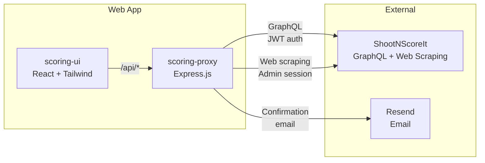

# SSI Kupittaa Cup — Scoring & Registration

Scoring and registration system for TurRes Kupittaa RESUL CUP shooting competitions, integrated with [ShootNScoreIt (SSI)](https://shootnscoreit.com).



## Applications

| App | URL | Purpose |
|-----|-----|---------|
| **Scoring** | `/#/` | Range officers enter match scores on mobile devices |
| **Registration** | `/#/register` | Shooters self-register for CUP events (no login required) |

## Quick Start

```bash
cd scoring-ui && npm install
cd ../scoring-proxy && npm install

# Create scoring-proxy/.env with SSI credentials
node --env-file=scoring-proxy/.env scoring-proxy/server.js
```

## Documentation

| Document | Description |
|----------|-------------|
| [User Guide](docs/user-guide.md) | How to use the scoring and registration apps |
| [Installation Guide](docs/installation-guide.md) | Deploy to Render with Resend email and GitHub CI |
| [Release Notes](docs/RELEASE-NOTES.md) | Version history and changelog |
| [Requirements](docs/requirements.md) | Full requirements traceability matrix |
| [Registration Flow](docs/registration-flow.md) | Backend sequence diagrams and SSI state machine |
| [Scoring Architecture](docs/scoring-architecture.md) | Proxy architecture, session management, scoring flow |
| [SSI Admin Operations](docs/ssi-admin-operations.md) | Web scraping endpoints and form field reference |
| **[Refactoring Plan](docs/refactoring-plan.md)** | **Software architecture analysis and refactoring strategy** |
| [Refactoring Visual Summary](docs/refactoring-visual-summary.md) | Quick reference with diagrams and comparisons |
| [AI Agent Guidelines](docs/ai-agent-guidelines.md) | Token-efficient development with AI assistants |

## Creating a Kupittaa Cup

```powershell
.\scripts\New-KupittaaCup.ps1 -Date "08-02-2026" -Username "user@example.com" -Password "pass"
```

Creates: 1 Cup + 3 Matches (Tarkkuus, Pika, Kuvio) + 3 squads per match. See `-TestMode` and `-CreateCalendarEvent` flags for test mode and WordPress integration.
