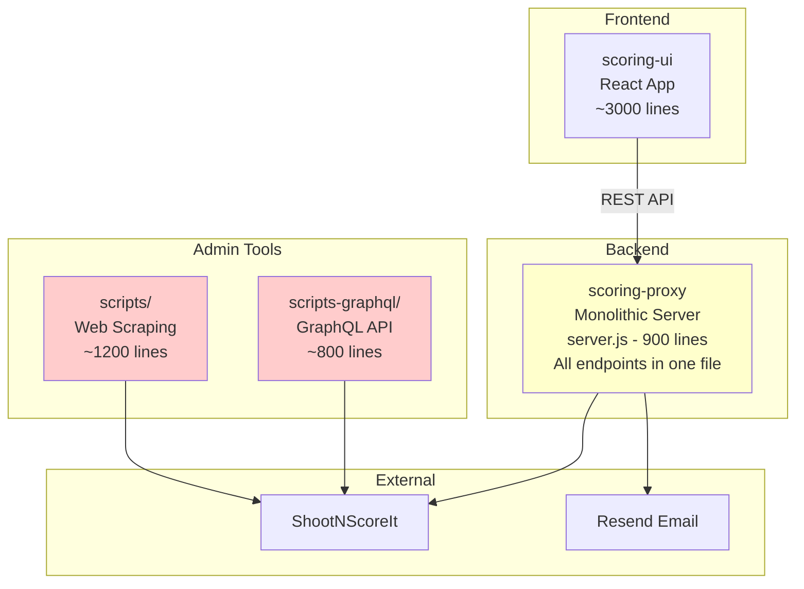
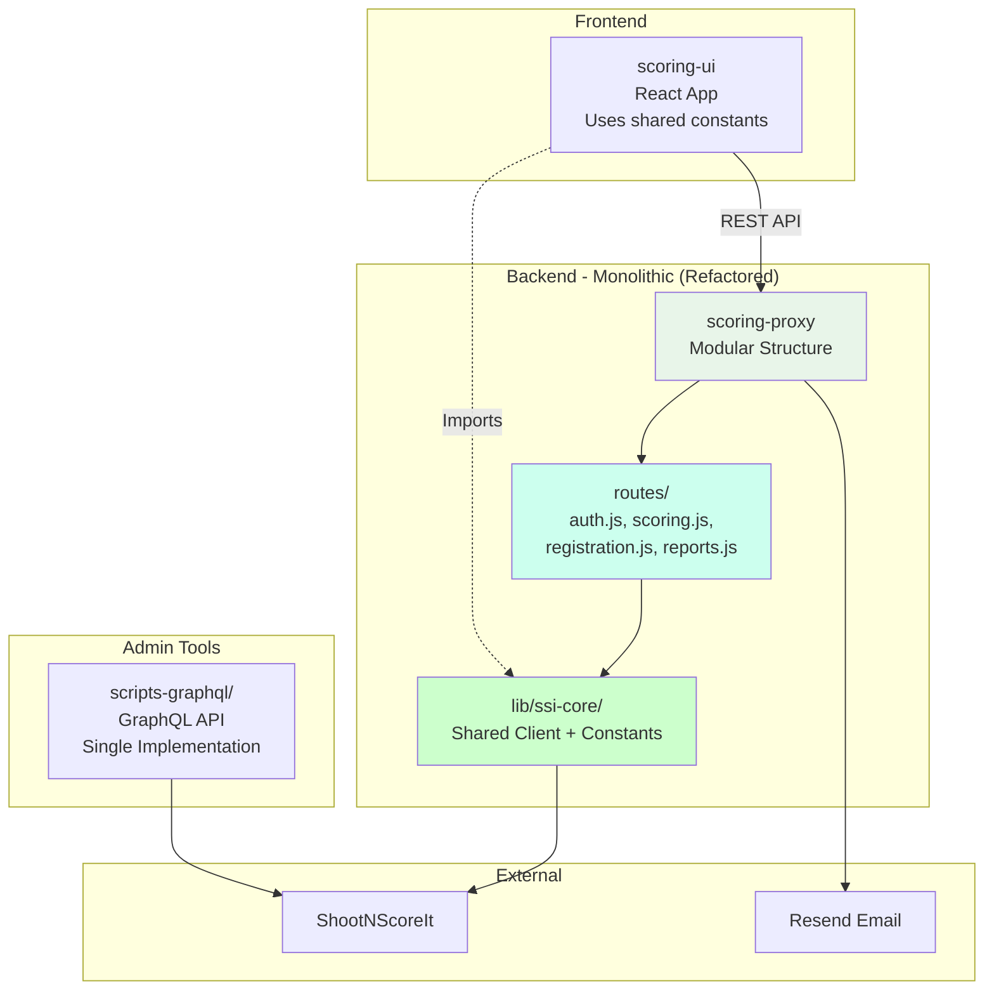

# Refactoring Plan - Visual Summary

**Quick Reference Guide for Stakeholders**

---

## Current vs. Proposed Architecture

### Current Architecture



**Issues:**
- 🔴 Two cup creation implementations (scripts vs scripts-graphql)
- 🔴 900-line monolithic server.js
- 🔴 Duplicated constants (SCORE_ZONES in UI and proxy)
- 🔴 No shared library for SSI operations

---

### Proposed Architecture (Alternative 1 - Recommended)



**Benefits:**
- ✅ Single cup creation implementation (scripts-graphql only)
- ✅ Modular server.js (split into route files ~100-150 lines each)
- ✅ Shared constants in lib/ssi-core/
- ✅ **No Docker/Kubernetes overhead**
- ✅ **Maintains monolithic benefits** (simple debugging, deployment)
- ✅ **No infrastructure costs** (container registries, orchestration)
- ✅ Small, focused services (100-200 lines each)
- ✅ Shared constants in ssi-sdk
- ✅ Reusable SSI library across all services

---

## Comparison at a Glance

| Aspect | Current | After Refactoring (Alt 1) |
|--------|---------|---------------------------|
| **Cup Creation Scripts** | 2 implementations (2,000 lines) | 1 implementation (800 lines) |
| **Largest File** | server.js (900 lines) | Any route file (~150 lines) |
| **Constants** | Duplicated in 2+ places | Single source (lib/ssi-core/) |
| **SSI Integration** | 3+ implementations | 1 shared library |
| **Token Consumption** | ~3,875 tokens/task | ~1,940 tokens/task (50% savings) |
| **Deployment** | 2 apps (UI + Proxy) | 2 apps (UI + Proxy) - Same! |
| **Infrastructure** | Simple (no containers) | Simple (no containers) - Same! |

---

## Token Consumption Impact

### Example: "Update Score Zones"

**Current:**
```
Agent must load:
- scoring-ui/src/App.jsx (500 lines)
- scoring-proxy/server.js (900 lines)
Total: ~4,000 tokens
```

**After Refactoring (Alternative 1):**
```
Agent loads only:
- scoring-proxy/lib/ssi-core/constants.js (50 lines)
Total: ~200 tokens (95% savings)
```

### Example: "Add New API Endpoint"

**Current:**
```
Agent must load:
- scoring-proxy/server.js (900 lines + all imports)
- scoring-ui/src/api.js (200 lines)
Total: ~3,500 tokens
```

**After Refactoring (Alternative 1):**
```
Agent loads only:
- scoring-proxy/routes/scoring.js (150 lines)
- scoring-ui/src/api.js (200 lines)
Total: ~1,200 tokens (66% savings)
```

### Overall Impact

| Task Category | Current Avg | Alt 1 (Monolith) | Savings |
|---------------|-------------|------------------|---------|
| Add endpoint | 3,500 tokens | 1,200 tokens | 66% |
| Update constants | 4,000 tokens | 200 tokens | 95% |
| Fix bug | 3,000 tokens | 1,500 tokens | 50% |
| Add feature | 5,000 tokens | 2,500 tokens | 50% |
| **Average** | **3,875 tokens** | **1,940 tokens** | **50%** |

**Translation:** For a 100-task project, Alternative 1 saves ~193,500 tokens with no infrastructure overhead.

---

## File Size Reduction

### Before Refactoring

```
scoring-proxy/server.js
├─ Lines: 900
├─ Concerns: 7 (auth, scoring, registration, reports, cups, management, health)
└─ Token cost per edit: ~3,000

scoring-ui/src/App.jsx
├─ Lines: 500
├─ Concerns: 8 (login, navigation, scoring, state management, persistence)
└─ Token cost per edit: ~1,500
```

### After Refactoring (Alternative 1 - Monolith)

```
scoring-proxy/server.js
├─ Lines: 150 (just route mounting)
├─ Concerns: 1 (bootstrapping)
└─ Token cost per edit: ~500

scoring-proxy/routes/scoring.js
├─ Lines: 150
├─ Concerns: 1 (scoring endpoints)
└─ Token cost per edit: ~500

scoring-proxy/lib/ssi-core/constants.js
├─ Lines: 50
├─ Concerns: 1 (shared constants)
└─ Token cost per edit: ~200
```

**Average file size:** 900 lines → 150 lines (83% reduction)

```
packages/scoring-service/src/
├─ routes/scoring.js (100 lines)
├─ session/manager.js (80 lines)
├─ validation/validator.js (60 lines)
└─ Token cost per edit: ~300-500

packages/registration-service/src/
├─ routes/registration.js (120 lines)
├─ captcha/handler.js (50 lines)
├─ email/templates.js (70 lines)
└─ Token cost per edit: ~200-400

apps/scoring-ui/src/
├─ pages/ScoringPage.jsx (150 lines)
├─ pages/RegistrationPage.jsx (180 lines)
├─ hooks/useScoring.js (80 lines)
└─ Token cost per edit: ~400-600
```

**Average file size:** 900 lines → 100 lines (89% reduction)

---

## Two Alternative Approaches

### Alternative 1: Monolithic Consolidation ⭐ **RECOMMENDED**

**Timeline:** 2-3 weeks  
**Complexity:** Low  
**Risk:** Low  

**What it does:**
- ✅ Creates shared `lib/ssi-core/` library for common code
- ✅ Consolidates cup creation (removes scripts/, keeps scripts-graphql/)
- ✅ Splits server.js into route modules (~150 lines each)
- ✅ **Maintains monolithic architecture** (proven benefits)
- ✅ **No Docker/Kubernetes** (avoids infrastructure costs)

**Good for:**
- Teams preferring monolithic architecture
- Avoiding Docker infrastructure overhead
- No container registry costs or limitations
- Quick improvements with immediate value
- Simple deployment (current infrastructure)

**Token savings:** 50% (3,875 → 1,940 tokens average)

**Score:** 4.2/5 (best fit for this project)

---

### Alternative 2: Microservice Architecture - NOT RECOMMENDED

**Timeline:** 7-10 weeks (phased)  
**Complexity:** High  
**Risk:** Medium-High  

**What it does:**
- Creates comprehensive `ssi-sdk` (TypeScript)
- Splits proxy into 5 independent services
- Implements API gateway
- **Requires Docker + Kubernetes deployment**
- **Requires container registry** (costs/limitations)

**Issues:**
- ❌ Docker infrastructure costs (container registries)
- ❌ Runtime limitations (local Docker Desktop now requires licenses)
- ❌ Orchestration complexity (Kubernetes, DevOps overhead)
- ❌ Overkill for current scale

**Only consider when:**
- Team grows to 5+ developers
- Need independent service scaling
- Docker infrastructure already available
- Have dedicated DevOps resources

**Token savings:** 82% (but at high infrastructure cost)

**Score:** 2.8/5 (infrastructure overhead outweighs benefits)

---

## Implementation Plan (Alternative 1 - Recommended)

### Phase 1: Consolidation (Weeks 1-3)

**Goal:** Eliminate redundancies within monolith

```
✅ Create lib/ssi-core/ shared library (not separate package)
✅ Consolidate cup creation (archive scripts/, keep scripts-graphql/)
✅ Split server.js into route modules
✅ Update UI and proxy to use shared constants
```

**Deliverable:** 
- Modular monolith structure
- 50% token reduction
- No infrastructure changes needed

**Timeline:** 2-3 weeks total

---

## Code Example: Before vs. After

### Updating Score Zones

**Before (Current):**

```javascript
// File: scoring-ui/src/App.jsx (line 15)
const SCORE_ZONES = ['X', '10', '9', '8', '7', '6', '5', '4', '3', '2', '1', 'M'];

// File: scoring-proxy/server.js (line 80)
const ZONES = ['X', '10', '9', '8', '7', '6', '5', '4', '3', '2', '1', 'M'];
```

**Problem:** Must update in 2 places, easy to forget one

---

**After (Alternative 1 - Monolith Consolidation):**

```javascript
// File: packages/ssi-core/src/constants.js
export const SCORE_ZONES = ['X', '10', '9', '8', '7', '6', '5', '4', '3', '2', '1', 'M'];

// File: scoring-ui/src/App.jsx
import { SCORE_ZONES } from '@ssi-integrator/ssi-core';

// File: scoring-proxy/server.js
import { SCORE_ZONES } from '@ssi-integrator/ssi-core';
```

**Benefit:** Single update point, guaranteed consistency

---

**After (Alternative 2 - Microservices):**

```typescript
// File: packages/ssi-sdk/src/constants.ts (TypeScript)
export const SCORE_ZONES = ['X', '10', '9', '8', '7', '6', '5', '4', '3', '2', '1', 'M'] as const;

export type ScoreZone = typeof SCORE_ZONES[number];
// ScoreZone type = 'X' | '10' | '9' | ... | 'M'

```javascript
// File: scoring-proxy/lib/ssi-core/constants.js
export const SCORE_ZONES = ['X', '10', '9', '8', '7', '6', '5', '4', '3', '2', '1', 'M'];

// File: scoring-ui/src/App.jsx
import { SCORE_ZONES } from '../../../scoring-proxy/lib/ssi-core/constants.js';

// File: scoring-proxy/routes/scoring.js
import { SCORE_ZONES } from '../lib/ssi-core/constants.js';
```

**Benefit:** Single update point, guaranteed consistency, no NPM packaging needed

---

## Resource Requirements

### Alternative 1: Monolith Consolidation ⭐ RECOMMENDED

**Development:**
- 1 developer, 2-3 weeks full-time
- Node.js experience required
- NO Docker/Kubernetes knowledge needed
- NO TypeScript required

**Infrastructure:**
- ✅ No changes to current deployment
- ✅ Same hosting (Render or similar)
- ✅ NO Docker infrastructure needed
- ✅ NO container registry costs

**Maintenance:**
- Reduced duplication
- Simpler debugging (monolithic benefits)
- Same operational model

---

### Alternative 2: Microservices - NOT RECOMMENDED

**Development:**
- 2-3 developers, 7-10 weeks combined
- Node.js, TypeScript experience required
- **Docker, Kubernetes knowledge required**
- DevOps expertise needed

**Infrastructure:**
- ❌ Container orchestration (Kubernetes) - Complex & Costly
- ❌ **Container registry** - Paid service or limitations
- ❌ **Docker Desktop** - Now requires license for companies
- ❌ Load balancer, monitoring stack
- ❌ Significantly higher operational overhead

**Maintenance:**
- More complex (distributed systems)
- Harder debugging (across services)
- Requires dedicated DevOps

---

## Risk Assessment

### Alternative 1: Very Low Risk ⭐

| Risk | Likelihood | Impact | Mitigation |
|------|------------|--------|------------|
| Breaking changes during refactor | Low | Medium | Comprehensive testing |
| Integration issues | Very Low | Low | Maintaining monolith structure |
| Adoption resistance | Very Low | Very Low | Minimal workflow changes |
| **Infrastructure costs** | **None** | **None** | **No new infrastructure** |

---

### Alternative 2: High Risk ❌

| Risk | Likelihood | Impact | Mitigation |
|------|------------|--------|------------|
| **Docker infrastructure costs** | **High** | **High** | **Requires paid container registry** |
| **Docker Desktop licensing** | **High** | **High** | **Enterprise license required** |
| Service orchestration complexity | High | High | Requires DevOps expertise |
| Debugging distributed systems | Medium | High | Expensive tooling needed |
| Team learning curve | Medium | Medium | Training, documentation, pair programming |
| Deployment complexity | Medium | High | Infrastructure as Code, automated pipelines |

**Overall Risk Level:** Acceptable with proper planning and phased approach

---

## Success Metrics

### Phase 1 Success Criteria

- [ ] ssi-sdk package published and used by UI + proxy
- [ ] Single cup creation script (scripts-graphql only)
- [ ] All existing tests pass
### Phase 1 Success Criteria (Alternative 1)

- [ ] lib/ssi-core/ shared library created and used
- [ ] Single cup creation implementation (scripts-graphql only)
- [ ] server.js split into route modules (~150 lines each)
- [ ] All existing tests pass
- [ ] No regressions in functionality
- [ ] Token consumption reduced by 50%+
- [ ] No new infrastructure dependencies

---

## Return on Investment (ROI)

### Alternative 1: Excellent ROI, Quick Payback ⭐ RECOMMENDED

**Investment:**
- 120-160 hours (2-3 weeks)
- ~$12,000-18,000 (developer time only)
- **$0 infrastructure costs**

**Returns:**
- 50% less code duplication → easier maintenance
- 50% faster bug fixes (smaller files)
- 50% token savings → $400-750/year (AI costs)
- **No ongoing infrastructure costs**
- Maintains monolithic debugging benefits

**Payback period:** 3-6 months

**Total 3-year value:** Saves ~$36,000-45,000 (maintenance + AI tokens)

---

### Alternative 2: Negative ROI, High Costs ❌ NOT RECOMMENDED

**Investment:**
- 400-600 hours (7-10 weeks)
- ~$50,000-75,000 (developer time)
- **$5,000-10,000/year infrastructure** (registries, monitoring, orchestration)

**Returns:**
- 82% token savings → $800-1,500/year (AI costs)
- BUT: Requires ongoing infrastructure costs
- BUT: Higher operational complexity
- BUT: Requires DevOps expertise

**Payback period:** Never (infrastructure costs exceed token savings)

**Total 3-year value:** **Costs** ~$75,000-105,000 (investment + infrastructure)

---

## Recommendation Summary

✅ **Recommended:** Alternative 1 (Monolithic Consolidation)

**Why:**
1. **Eliminates redundancy** (single source of truth for code and constants)
2. **Maintains monolithic benefits** (simple debugging, proven architecture)
3. **No infrastructure overhead** (no Docker, Kubernetes, or container costs)
4. **Quick implementation** (2-3 weeks vs 7-10 weeks)
5. **50% token savings** (sufficient for AI efficiency)
6. **Excellent ROI** (3-6 month payback, no ongoing costs)

**Alternative 2 (Microservices) NOT recommended because:**
- ❌ Requires Docker infrastructure (container registry costs/limitations)
- ❌ Docker Desktop now requires enterprise license
- ❌ Adds operational complexity (Kubernetes, orchestration)
- ❌ Negative ROI (infrastructure costs > token savings)
- ❌ Overkill for current scale and team size

---

## Next Steps

1. **Review this plan** with stakeholders
2. **Begin Alternative 1 implementation** (monolithic consolidation)
3. **Create implementation tickets** for:
   - Create lib/ssi-core/ shared library
   - Archive scripts/ directory
   - Split server.js into route modules
4. **Start development** (2-3 week timeline)

**Questions?** See full details in `docs/refactoring-plan.md`

---

**Document Version:** 1.0  
**Last Updated:** 2026-02-08  
**Status:** Proposed
