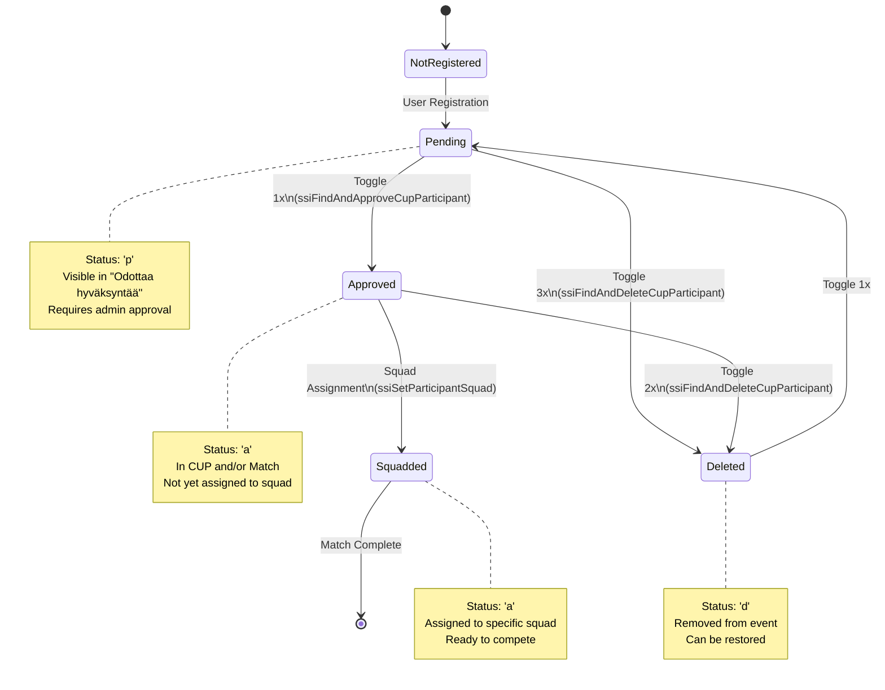
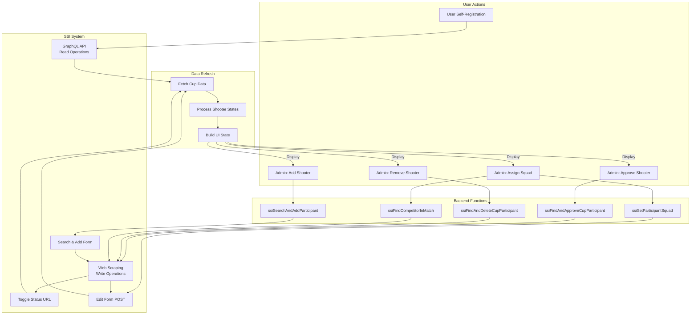

# Shooter State Management

This document describes the state management system for shooters in the SSI Scoring system, including state transitions, functions, and the shooter identification system.

## Table of Contents

- [Design Requirements](#design-requirements)
- [State Diagram](#state-diagram)
- [Function Interaction Diagram](#function-interaction-diagram)
- [State Management Functions](#state-management-functions)
- [Shooter Identification System](#shooter-identification-system)
- [Example Scenarios](#example-scenarios)

---

## Design Requirements

### Critical Identification Requirements

**⚠️ REQUIREMENT: Email-Based Exact Match Only**

The shooter identification system **MUST** use the following strict requirements to prevent data corruption and incorrect operations:

#### 1. Email is the Primary Identifier

**Requirement:** Email address is the PRIMARY and REQUIRED identifier for all shooter operations.

- **Rationale:** SSI supports wildcard/partial name searches which can return ambiguous results. For example, searching "Ari" may return both "Ari Virtanen" and "Jari Virtanen". Email-based identification eliminates this ambiguity.
- **Implementation:** All GraphQL queries fetch email addresses. Backend uses `firstName|||lastName|||email` composite keys.
- **Exception:** When email is missing, system generates unique error keys (e.g., `ERROR_NO_EMAIL_abc123`) to prevent false matches.

#### 2. Exact Match Required

**Requirement:** When using participant IDs from GraphQL, ONLY perform exact ID matches. Name-based fallback matching is PROHIBITED in production flows.

- **Rationale:** SSI's wildcard name search can return unrelated participants with similar names, causing state changes on wrong individuals (e.g., approving "Ari" when searching for "Jari").
- **Implementation:**
  - State functions accept optional `participantId` parameter (5th parameter)
  - When `participantId` provided: Use ID directly (no name search)
  - When `participantId` NOT provided: Legacy fallback (logs warning)
- **Enforcement:** Backend validates `cupParticipantId` exists before calling CUP state functions

#### 3. Fail-Safe: Stop and Alert on Ambiguity

**Requirement:** If exact match cannot be found via participant ID, the operation MUST fail with a clear error message. Never proceed with ambiguous or partial matches.

- **Rationale:** Incorrect operations (approving/deleting wrong shooter) cause data integrity issues and are "extremely annoying" to fix.
- **Implementation:**
  - Backend: Return HTTP 400 with descriptive error if `participantId` missing
  - Frontend: Display error alert to user
  - Logs: Warn about ambiguity attempts
- **Error Messages:**
  - `"Cannot approve in CUP: shooter is not pending in CUP (only in matches)"`
  - `"Cannot remove from CUP: shooter is not pending in CUP (only in matches)"`

#### 4. UI Visibility Requirements

**Requirement:** UI MUST clearly indicate when operations cannot be performed, preventing user errors.

- **Implementation:**
  - Hide approve/remove buttons for match-only pending shooters
  - Show `"(Vain osakilpailuissa)"` label instead
  - Display email addresses for all shooters
  - Show `"🚨 Sähköposti puuttuu"` for missing emails

### Design Principles

1. **Email First, Name Second:** Always use email as primary key. Names are for display only.
2. **Explicit over Implicit:** Require explicit participant IDs. No silent fallbacks to name-based matching.
3. **Fail Loudly:** Alert users immediately when exact match fails. Never guess.
4. **Prevent Ambiguity:** Unique keys for missing emails prevent false positives.
5. **Defensive Programming:** Validate inputs, log warnings, return clear errors.

---

## State Diagram

The following diagram shows the possible states for a shooter in the SSI system and the transitions between them:



### State Descriptions

| State | Status Code | Description | Display Location |
|-------|-------------|-------------|------------------|
| **Not Registered** | - | Shooter exists in SSI but not registered for this event | - |
| **Pending** | `p` | Registration submitted, awaiting admin approval | "Odottaa hyväksyntää" section |
| **Approved** | `a` | Approved for event, not yet assigned to squad | "Hyväksytty" section or Match lists |
| **Squadded** | `a` | Approved and assigned to a specific squad | Squad cards |
| **Deleted** | `d` | Removed from event (can be restored) | Not visible in UI |

---

## Function Interaction Diagram

The following diagram shows how state management functions interact with the SSI system and the UI:



### Data Flow

1. **Registration Phase**
   - User submits registration → Creates Pending entry in SSI
   - GraphQL fetches competitors with status='p'
   - UI displays in "Odottaa hyväksyntää" section

2. **Approval Phase**
   - Admin clicks approve → `ssiFindAndApproveCupParticipant`
   - Function scrapes participants page, finds shooter by name
   - Toggles status once: Pending → Approved
   - UI refreshes via GraphQL fetch

3. **Squad Assignment Phase**
   - Admin assigns squad → `ssiFindCompetitorInMatch` + `ssiSetParticipantSquad`
   - Function finds participant ID in match
   - POSTs edit form with squad selection
   - UI shows shooter in squad card

4. **Removal Phase**
   - Admin removes pending → `ssiFindAndDeleteCupParticipant`
   - Function toggles status 3 times: Pending → Approved → Approved(no results) → Deleted
   - UI hides shooter (status='d')

---

## State Management Functions

### 1. ssiFindAndApproveCupParticipant

**Purpose:** Approve a pending shooter in a CUP (competition event).

**Location:** `scoring-proxy/lib/ssi-core/client.js:621`

**Signature:**
```javascript
async function ssiFindAndApproveCupParticipant(cupId, shooterName, cookies, email = null, participantId = null)
```

**Parameters:**
- `cupId` (string): SSI CUP event ID
- `shooterName` (string): Full name of shooter to approve
- `cookies` (object): SSI session cookies for authentication
- `email` (string, optional): Shooter's email for logging
- `participantId` (string, optional): **GraphQL participant ID for email-based identification** (recommended)

**Returns:**
```javascript
{ success: boolean, message: string }
```

**Algorithm:**

**When `participantId` provided (recommended path):**
1. **Use GraphQL-Verified ID**
   - Directly use the participant ID from GraphQL (where emails are available)
   - Fetch CUP participants page to check current status
   - Skip name-based HTML scraping entirely
   - **No ambiguity possible** - exact ID match

2. **Check Current Status**
   - Extract status from toggle-status button for the specific participant ID
   - If already "Approved", return success immediately

3. **Toggle Status Once**
   - GET `/event/participant/137/{participantId}/toggle-status/?next={partUrl}`
   - Status cycle: **Pending → Approved** (one toggle from Pending)
   - Verify new status is "Approved"

**When `participantId` NOT provided (legacy fallback):**
1. **Scrape CUP Participants Page**
   - GET `/event/136/{cupId}/participants/`
   - Parse HTML to find participant links

2. **Find Shooter by Name**
   - Extract participant ID from link: `/event/participant/137/{id}/`
   - Collect ALL matches using word-based search (handles variations in spacing)
   - Search words must all appear in name (case-insensitive)
   - **Multiple Match Detection**: If more than one match found, log warning with all matching names
   - **Email for Disambiguation**: If email provided, it's logged for debugging (but cannot be verified from HTML)
   - Uses first match as selection ⚠️ **Can select wrong shooter if multiple similar names**

3. **Check Current Status & Toggle** (same as ID-based path)

**State Transition:**
- `status='p'` → `status='a'` (one toggle)

**Usage:**
```javascript
// RECOMMENDED: With participant ID from GraphQL (email-based identification)
const result = await ssiFindAndApproveCupParticipant(
  cupId,
  shooterName,
  cookies,
  email,
  cupParticipantId // From GraphQL: cupPending[].id
)
// result: { success: true, message: 'Approved' }

// LEGACY: Without participant ID (name-based matching - may be ambiguous)
const result = await ssiFindAndApproveCupParticipant(
  '12345',
  'Jari Virtanen',
  cookies,
  'jari.virtanen@example.com',
  null // Falls back to name-based HTML scraping
)
```

**Error Cases:**
- Participant not found in CUP → `{ success: false, message: 'Participant not found in CUP' }`
- Unexpected status after toggle → `{ success: false, message: 'Toggle resulted in "X", expected "Approved"' }`

**Important Notes:**
- **⚠️ Always pass `participantId` when available** to avoid ambiguity with similar names
- Uses web scraping because CUP participant edit form (content type 137) does NOT support status changes
- Only toggle-status URL works for CUP participants
- When `participantId` provided: exact ID match (no ambiguity)
- When `participantId` NOT provided: name-based matching warns if multiple matches found (e.g., "Jari Virtanen" and "Ari Virtanen") and selects first match

---

### 2. ssiFindAndDeleteCupParticipant

**Purpose:** Remove/delete a pending shooter from a CUP (competition event).

**Location:** `scoring-proxy/lib/ssi-core/client.js:509`

**Signature:**
```javascript
async function ssiFindAndDeleteCupParticipant(cupId, shooterName, cookies, email = null, participantId = null)
```

**Parameters:**
- `cupId` (string): SSI CUP event ID
- `shooterName` (string): Full name of shooter to delete
- `cookies` (object): SSI session cookies for authentication
- `email` (string, optional): Shooter's email for logging
- `participantId` (string, optional): **GraphQL participant ID for email-based identification** (recommended)

**Returns:**
```javascript
{ success: boolean, message: string }
```

**Algorithm:**

**When `participantId` provided (recommended path):**
1. **Use GraphQL-Verified ID**
   - Directly use the participant ID from GraphQL (where emails are available)
   - Fetch CUP participants page to check current status
   - Skip name-based HTML scraping entirely
   - **No ambiguity possible** - exact ID match

2. **Check Current Status**
   - Extract status from toggle-status button for the specific participant ID
   - If already "Deleted", return success immediately

3. **Toggle Status 3 Times**
   - Toggle cycle: **Pending → Approved → Approved(no results) → Deleted**
   - Each toggle: GET `/event/participant/137/{participantId}/toggle-status/`
   - Verify status after each toggle
   - Early exit if "Deleted" status reached before 3 toggles

4. **Verify Final Status**
   - Fetch page again to confirm final status
   - Expect "Deleted" status

**When `participantId` NOT provided (legacy fallback):**
1. **Scrape CUP Participants Page & Find by Name**
   - GET `/event/136/{cupId}/participants/`
   - Parse HTML to find participant links
   - Extract participant ID from link: `/event/participant/137/{id}/`
   - Collect ALL matches using word-based search
   - **Multiple Match Detection**: If more than one match found, log warning
   - **Email for Disambiguation**: If email provided, it's logged for debugging
   - Uses first match as selection ⚠️ **Can select wrong shooter if multiple similar names**

2. **Check Current Status & Toggle** (same as ID-based path)

**State Transition:**
- `status='p'` → `status='a'` → (intermediate) → `status='d'` (three toggles)

**Usage:**
```javascript
// RECOMMENDED: With participant ID from GraphQL (email-based identification)
const result = await ssiFindAndDeleteCupParticipant(
  cupId,
  shooterName,
  cookies,
  email,
  cupParticipantId // From GraphQL: cupPending[].id
)
// result: { success: true, message: 'Deleted' }

// LEGACY: Without participant ID (name-based matching - may be ambiguous)
const result = await ssiFindAndDeleteCupParticipant(
  '12345',
  'Ari Virtanen',
  cookies,
  'ari.virtanen@example.com',
  null // Falls back to name-based HTML scraping
)
```

**Error Cases:**
- Participant not found in CUP → `{ success: false, message: 'Participant not found in CUP' }`
- Unexpected final status → `{ success: false, message: 'Toggle resulted in "X", expected "Deleted"' }`

**Important Notes:**
- **⚠️ Always pass `participantId` when available** to avoid ambiguity with similar names
- Requires 3 toggles to reach Deleted state from Pending
- Function tracks status after each toggle for safety
- Can be used on any status, not just Pending
- When `participantId` provided: exact ID match (no ambiguity)
- When `participantId` NOT provided: name-based matching warns if multiple matches found

---

### 3. ssiSearchAndAddParticipant

**Purpose:** Search for a shooter in SSI database and add them to a CUP or Match event.

**Location:** `scoring-proxy/lib/ssi-core/client.js:387`

**Signature:**
```javascript
async function ssiSearchAndAddParticipant(eventContentType, eventId, email, cookies, { firstName, lastName } = {})
```

**Parameters:**
- `eventContentType` (number): SSI content type (136=CUP, 91=Match)
- `eventId` (string): Event ID (Cup ID or Match ID)
- `email` (string): Shooter's email address (preferred for search)
- `cookies` (object): SSI session cookies
- `options.firstName` (string): First name (fallback if email fails)
- `options.lastName` (string): Last name (fallback if email fails)

**Returns:**
```javascript
{ 
  success: boolean, 
  message: string,
  shooterName?: string  // Name from search results
}
```

**Algorithm:**
1. **POST Search Form**
   - URL: `/event/{contentType}/{eventId}/participant-search-and-add/`
   - Form fields: `last_name`, `first_name`, `email`, `submit=Search`
   - Prefers email search when available

2. **Check Search Results**
   - "no results" message → User not found in SSI database
   - Django form errors → Invalid input
   - Success → HTML table with matching users

3. **Extract Shooter Name**
   - Parse result table for shooter name
   - Found in first `<td>` cell of row containing register link

4. **Find Register Link**
   - Pattern: `/participant-search-and-add/{userId}/register/`
   - Alternative: `/register-participant/{userId}/`

5. **Follow Register Link**
   - May show confirmation form or redirect directly
   - Handle both GET and POST confirmation flows

**State Transition:**
- Not Registered → `status='a'` (Approved)
- Creates new participant entry in the event

**Usage:**
```javascript
// Add to CUP
const result = await ssiSearchAndAddParticipant(
  136, cupId, 'user@example.com', cookies, 
  { firstName: 'John', lastName: 'Doe' }
)

// Add to Match
const result = await ssiSearchAndAddParticipant(
  91, matchId, 'user@example.com', cookies,
  { firstName: 'John', lastName: 'Doe' }
)
```

**Error Cases:**
- `{ success: false, message: 'user_not_found' }` - Shooter not in SSI database
- `{ success: false, message: 'Error text' }` - Django form validation error

**Important Notes:**
- Email search is more reliable than name search
- Can add same person to multiple matches with different identities
- Returns shooter name from search results for verification
- Two-step form: search → register (some users have confirmation form)

---

### 4. ssiSetParticipantSquad

**Purpose:** Assign a shooter to a specific squad within a match and optionally change their status.

**Location:** `scoring-proxy/lib/ssi-core/client.js:679`

**Signature:**
```javascript
async function ssiSetParticipantSquad(participantId, squadNumber, cookies, statusOverride = 'a')
```

**Parameters:**
- `participantId` (string): SSI participant ID (content type 93)
- `squadNumber` (number): Squad number (1-indexed, e.g., 1, 2, 3)
- `cookies` (object): SSI session cookies
- `statusOverride` (string): Status to set ('a'=Approved, 'p'=Pending) - defaults to 'a'

**Returns:**
```javascript
{ success: boolean, message?: string }
```

**Algorithm:**
1. **GET Edit Form**
   - URL: `/event/participant/93/{participantId}/edit/`
   - Extract form HTML

2. **Extract Squad Options**
   - Parse `<select name="squad">` options
   - Match squad number to option value
   - Pattern: `<option value="4262">Squad 3</option>`

3. **Find Squad Value**
   - Match "Squad N" label or Nth non-empty option
   - Fallback: Use Nth option if label matching fails

4. **Extract All Form Fields**
   - Use shared helper `_extractFormFields()` to preserve all form data
   - Prevents loss of hidden fields and selections

5. **Override Squad and Status**
   - Set `squad` field to matched option value
   - Set `status` field to statusOverride

6. **POST Edit Form**
   - URL: `/event/participant/93/{participantId}/edit/`
   - Content-Type: `application/x-www-form-urlencoded`
   - Handle redirect (302/301) or form validation errors

**State Transition:**
- `status='a'` + no squad → `status='a'` + squad assigned
- Approved → Squadded (status code unchanged, squad field populated)

**Usage:**
```javascript
// Assign to squad 3
const result = await ssiSetParticipantSquad(participantId, 3, cookies)
// result: { success: true }

// In POST /api/manage/cup/:id/assign-squad
const participantId = await ssiFindCompetitorInMatch(matchId, shooterName, cookies)
const sqResult = await ssiSetParticipantSquad(participantId, squadNumber, cookies)
```

**Error Cases:**
- Squad option not found → Throws error: `Squad N not found in edit form options`
- Edit form errors → `{ success: false, message: 'Error text from form' }`
- HTTP error → Throws error: `Participant edit failed HTTP {status}`

**Important Notes:**
- Must have participant ID (use `ssiFindCompetitorInMatch` to find it)
- Squad numbers are 1-indexed (Squad 1, Squad 2, etc.)
- Edit form preserves all existing fields
- Redirects (302) indicate success
- Only works for Match participants (content type 93), not CUP participants (content type 137)

---

### 5. ssiFindCompetitorInMatch

**Purpose:** Find a competitor's participant ID within a match by scraping the participants page.

**Location:** `scoring-proxy/lib/ssi-core/client.js:768`

**Signature:**
```javascript
async function ssiFindCompetitorInMatch(matchId, shooterName, cookies, email = null)
```

**Parameters:**
- `matchId` (string): SSI Match event ID
- `shooterName` (string): Full name of shooter to find
- `cookies` (object): SSI session cookies
- `email` (string, optional): Shooter's email for logging and disambiguation

**Returns:**
- `string` - Participant ID if found
- `null` - Shooter not found in match

**Algorithm:**
1. **GET Match Participants Page**
   - URL: `/event/91/{matchId}/participants/`
   - Parse HTML response

2. **Extract Participant Links**
   - Pattern: `<a href="/event/participant/93/{id}/">Name</a>`
   - Includes class attributes and other variations

3. **Match Shooter Name**
   - Normalize search: split name into words
   - Keep single-char digits (e.g., "2" in "Tuloskone 2")
   - Filter words: length > 1 OR contains digit
   - Collect ALL matches where all search words appear in participant name (case-insensitive)
   - **Multiple Match Detection**: If more than one match found, log warning with all matching names
   - **Email for Disambiguation**: If email provided, it's logged for debugging (but cannot verify from HTML)

4. **Return Participant ID**
   - First matching participant ID is returned
   - Returns `null` if no match found

**State Transition:**
- None (read-only operation)

**Usage:**
```javascript
// Find participant ID before squad assignment
const participantId = await ssiFindCompetitorInMatch(matchId, 'John Doe', cookies, 'john.doe@example.com')
if (participantId) {
  await ssiSetParticipantSquad(participantId, squadNumber, cookies)
}

// In POST /api/manage/cup/:id/assign-squad
for (const matchId of matchIds) {
  const participantId = await ssiFindCompetitorInMatch(matchId, shooterName, cookies, email)
  if (!participantId) {
    // Handle not found
  }
}
```

**Error Cases:**
- HTTP error → Throws error: `Participants page HTTP {status} for match {matchId}`
- Not found → Returns `null`

**Important Notes:**
- Required before calling `ssiSetParticipantSquad`
- Uses flexible word-based matching (handles spacing variations)
- Matches against participant name in HTML, not GraphQL data
- Single-character digits are preserved for distinguishing similar names
- Returns only Match participant IDs (content type 93)
- **Ambiguity Detection**: Warns when multiple matches found (e.g., "Jari Virtanen" and "Ari Virtanen")
- Email parameter helps identify correct shooter when names are similar

---

## Shooter Identification System

The system uses **email-based identification** as the primary key for tracking shooters across different contexts (CUP vs Match, different SSI identities).

### Composite Key Format

```
firstName|||lastName|||email
```

Example: `"John|||Doe|||john.doe@example.com"`

### Key Generation Logic

**Location:** `scoring-proxy/routes/management.js:83-105`

```javascript
function getShooterKey(firstName, lastName, email) {
  // Primary: Use email if available
  if (email && email.trim()) {
    return `${firstName}|||${lastName}|||${email.toLowerCase()}`
  }
  
  // Fallback: Generate unique error key for missing emails
  // Prevents false matches between shooters with same name but missing emails
  const randomSuffix = Math.random().toString(36).substring(2, 8)
  return `ERROR_NO_EMAIL_${randomSuffix}_${firstName}|||${lastName}`
}
```

### Why Email-Based Identification?

1. **Multiple SSI Identities**
   - Same person may have multiple SSI accounts with different emails
   - Name-only matching would incorrectly merge these identities
   - Email distinguishes between accounts

2. **Ambiguity Prevention**
   - "Jari Virtanen" and "Ari Virtanen" could be confused with name-only matching
   - Email ensures correct identification

3. **Missing Email Handling**
   - Shooters without emails get unique error keys
   - Prevents false matches: two "John Doe" entries without emails are kept separate
   - UI displays "🚨 Sähköposti puuttuu" indicator

### Email in State Management Functions

**Current Implementation:**

All three web-scraping state management functions now accept an optional `email` parameter:
- `ssiFindAndApproveCupParticipant(cupId, shooterName, cookies, email = null)`
- `ssiFindAndDeleteCupParticipant(cupId, shooterName, cookies, email = null)`
- `ssiFindCompetitorInMatch(matchId, shooterName, cookies, email = null)`

**Purpose:**
1. **Logging & Debugging**: Email is included in debug logs to identify which shooter was processed
2. **Ambiguity Detection**: Functions warn when multiple name matches are found
3. **Future-Proofing**: Ready for email-based verification if SSI adds email to HTML pages

**Limitation:**
- SSI participant HTML pages do NOT include email addresses in the participant lists
- Email cannot be used for matching against scraped HTML (SSI limitation)
- Functions still use name-based matching as the primary mechanism
- Email parameter is used for logging, warnings, and future verification only

**Example Warning:**
```
[cup-approve] WARNING: Multiple name matches found for "Jari Virtanen" in CUP 12345: ["Jari Virtanen", "Ari Virtanen"]
[cup-approve] Email provided for disambiguation: jari.virtanen@example.com (but cannot verify from HTML)
```

### GraphQL Email Fields

**Email fields are fetched at two levels:**

1. **CUP Competitor Level:** `competitor.email`
2. **Shooter Level:** `competitor.shooter.email`

**Fallback Logic:**
```javascript
const email = c.email || c.shooter.email || ''
```

**GraphQL Query:**
```graphql
competitors {
  id status email              # CUP-level email
  shooter {
    first_name last_name
    email                       # Shooter-level email (fallback)
  }
}
```

### Name-Only Fallback Matching

**Context:** Comparing CUP participants vs Match participants

When emails differ between CUP and Match data for the same person, the system uses **name-based fallback matching**:

```javascript
// Exact match (preferred)
if (cupShooterKey === matchShooterKey) {
  // Same key, merge data
}

// Name-only fallback (when emails differ)
if (cupFirstName === matchFirstName && cupLastName === matchLastName) {
  // Names match but emails differ, still merge
  // This handles email field inconsistencies
}
```

**Location:** `scoring-proxy/routes/management.js:152-213`

### Email Display in UI

All shooter sections display email when available:

```jsx
<div className="text-xs text-gray-500 truncate">
  {shooter.email}
</div>
```

**Sections with email display:**
- Unsquadded shooters
- Inconsistent shooters
- Cup-only shooters
- Match-only shooters
- Squad cards

**Missing email indicator:**
```jsx
{shooter.hasEmailError && (
  <div className="text-xs text-red-600">
    🚨 Sähköposti puuttuu
  </div>
)}
```

---

## Example Scenarios

### Scenario 1: Jari - Pending in CUP Only

**Setup:**
- Jari Virtanen registers for cup via web form
- Registration creates pending entry in CUP (content type 136)
- Jari is NOT yet added to any matches

**SSI State:**
```
CUP competitors: [
  { id: "12345", status: "p", 
    shooter: { first_name: "Jari", last_name: "Virtanen", email: "jari@example.com" } }
]
Matches: [] (no entries)
```

**UI Display:**
```
Section: "Odottaa hyväksyntää" (Pending Approval)
- Jari Virtanen
  jari@example.com
  [Hyväksy] [Poista]
```

**Admin Actions:**
1. **Approve:** Calls `ssiFindAndApproveCupParticipant`
   - Toggles status once: `p` → `a`
   - Jari moves to "Hyväksytty" section
   
2. **Remove:** Calls `ssiFindAndDeleteCupParticipant`
   - Toggles status 3 times: `p` → `a` → ... → `d`
   - Jari disappears from UI (deleted)

### Scenario 2: Ari - Multiple SSI Identities

**Setup:**
- Ari Virtanen has TWO different SSI accounts:
  - Account 1: ari.virtanen@work.com (used for CUP registration)
  - Account 2: ari.virtanen@personal.com (used for Match registration)
- Same person, different emails = different identities in SSI

**SSI State:**
```
CUP competitors: [
  { id: "12346", status: "a",
    shooter: { first_name: "Ari", last_name: "Virtanen", 
               email: "ari.virtanen@work.com" } }
]

Match competitors: [
  { id: "78901", status: "a", 
    first_name: "Ari", last_name: "Virtanen",
    email: "ari.virtanen@personal.com" }
]
```

**Backend Processing:**

```javascript
// CUP shooter key
const cupKey = getShooterKey("Ari", "Virtanen", "ari.virtanen@work.com")
// → "Ari|||Virtanen|||ari.virtanen@work.com"

// Match shooter key  
const matchKey = getShooterKey("Ari", "Virtanen", "ari.virtanen@personal.com")
// → "Ari|||Virtanen|||ari.virtanen@personal.com"

// Different keys → Treated as separate shooters
cupKey !== matchKey  // true
```

**UI Display:**

```
Section: "Vain Cupissa" (Cup-only)
- Ari Virtanen
  ari.virtanen@work.com
  [Lisää otteluihin]

Section: "Vain otteluissa" (Match-only)  
- Ari Virtanen
  ari.virtanen@personal.com
  [Lisää Cuppiin]
```

**Admin Actions:**
- Each identity is managed separately
- Admin can choose which identity to use for which context
- System prevents false merging of the two identities

**Why This Matters:**
- Name-only matching would incorrectly merge these as one person
- Email-based keys keep them separate
- Admin has visibility into both identities
- Admin can coordinate which email/identity to use

### Scenario 3: Missing Email Ambiguity

**Setup:**
- Two shooters named "Matti Meikäläinen"
- Neither has email in SSI database
- Both registered for the same event

**SSI State:**
```
CUP competitors: [
  { id: "11111", status: "p",
    shooter: { first_name: "Matti", last_name: "Meikäläinen", email: "" } },
  { id: "22222", status: "p",
    shooter: { first_name: "Matti", last_name: "Meikäläinen", email: "" } }
]
```

**Backend Processing:**

```javascript
// First Matti - gets unique error key
const key1 = getShooterKey("Matti", "Meikäläinen", "")
// → "ERROR_NO_EMAIL_a1b2c3_Matti|||Meikäläinen"

// Second Matti - gets different unique error key
const key2 = getShooterKey("Matti", "Meikäläinen", "")
// → "ERROR_NO_EMAIL_x9y8z7_Matti|||Meikäläinen"

// Different keys → Kept separate
key1 !== key2  // true
```

**UI Display:**

```
Section: "Odottaa hyväksyntää"
- Matti Meikäläinen
  🚨 Sähköposti puuttuu
  [Hyväksy] [Poista]

- Matti Meikäläinen  
  🚨 Sähköposti puuttuu
  [Hyväksy] [Poista]
```

**Why This Matters:**
- Without unique keys, the two Mattis would be merged incorrectly
- Error keys with random suffixes ensure they stay separate
- Admin sees warning that email is missing
- Admin must identify correct shooter by other means (club, age, etc.)

---

## Summary

### State Transitions

| From | To | Toggles | Function |
|------|-----|---------|----------|
| Not Registered | Approved | - | `ssiSearchAndAddParticipant` |
| Pending | Approved | 1 | `ssiFindAndApproveCupParticipant` |
| Pending | Deleted | 3 | `ssiFindAndDeleteCupParticipant` |
| Approved | Squadded | - | `ssiFindCompetitorInMatch` + `ssiSetParticipantSquad` |

### Key Principles

1. **Email is Primary Key** - Name-only matching is unreliable
2. **Toggle Cycling** - SSI status changes via toggle-status URL (no edit form for CUP)
3. **Web Scraping Required** - GraphQL is read-only, state changes need form POSTs
4. **Unique Error Keys** - Missing emails get random suffixes to prevent false matches
5. **Two Content Types** - CUP (136/137) and Match (91/93) have different behaviors

### Common Patterns

**Adding a Shooter:**
```javascript
// 1. Search and add to event
await ssiSearchAndAddParticipant(contentType, eventId, email, cookies, { firstName, lastName })

// 2. If CUP and pending, approve
await ssiFindAndApproveCupParticipant(cupId, shooterName, cookies)

// 3. If Match, assign squad
const participantId = await ssiFindCompetitorInMatch(matchId, shooterName, cookies)
await ssiSetParticipantSquad(participantId, squadNumber, cookies)
```

**Removing a Shooter:**
```javascript
// Delete from CUP (toggles 3x)
await ssiFindAndDeleteCupParticipant(cupId, shooterName, cookies)

// Delete from Match (toggle via edit form)
const participantId = await ssiFindCompetitorInMatch(matchId, shooterName, cookies)
// (no dedicated delete function for Match participants - use toggle-status URL directly)
```

---

## Related Documentation

- [Management Page Design](./manage-page-design.md) - UI/UX details
- [SSI Admin Operations](./ssi-admin-operations.md) - Admin workflows
- [Add to Cup Flow](./add-to-cup-flow.md) - Adding shooters to events

---

*Last Updated: 2026-02-10*
