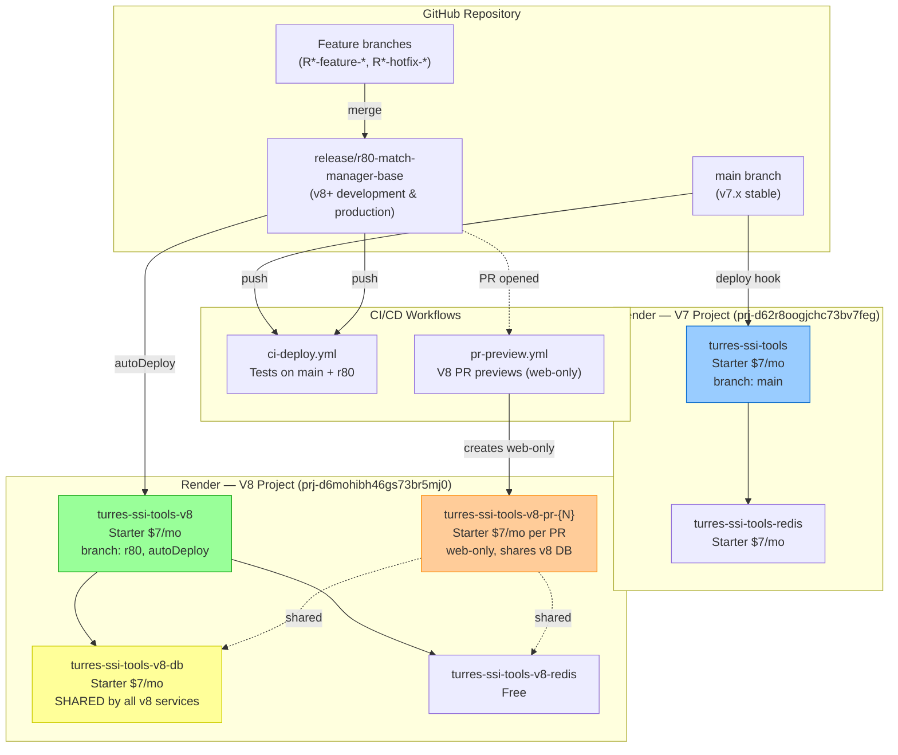

# Deployment Topology & Branch Strategy

**Last updated:** 2026-03-08

---

## Branch → Deployment Map (Render-Only)



---

## Render Resource Inventory

### V7 Project (`prj-d62r8oogjchc73bv7feg`, env `evm-d66usornv86c73dbvdng`)

| Resource | Type | Plan | Cost | Notes |
|----------|------|------|------|-------|
| `turres-ssi-tools` | Web service | Starter | $7/mo | branch: `main`, autoDeploy via deploy hook |
| `turres-ssi-tools-redis` | Key Value | Starter | $7/mo | Session storage for v7 |

### V8 Project (`prj-d6mohibh46gs73br5mj0`, env `evm-d6mohuf5r7bs73cistqg`)

| Resource | Type | Plan | Cost | Notes |
|----------|------|------|------|-------|
| `turres-ssi-tools-v8` | Web service | Starter | $7/mo | branch: `release/r80-match-manager-base`, autoDeploy |
| `turres-ssi-tools-v8-db` | PostgreSQL | Starter | $7/mo | **Shared** by v8 production + all PR previews |
| `turres-ssi-tools-v8-redis` | Key Value | Free | $0 | **Shared** session storage for v8 |
| `turres-ssi-tools-v8-pr-{N}` | Web service | Starter | $7/mo | Per-PR, web-only, shares v8 DB+Redis |

### Cost Summary

| Item | Monthly Cost |
|------|-------------|
| V7 web + Redis | $14 |
| V8 web + DB + Redis | $14 + $7 = $21 |
| Per active V8 PR | $7 each |
| **Base total (no PRs)** | **$35/mo (~€32)** |
| **With 1 active PR** | **$42/mo (~€39)** |

---

## How It Works

### V7 Production (main branch)
- Push to `main` → `ci-deploy.yml` runs tests → triggers Render deploy hook
- Render auto-deploys the `turres-ssi-tools` service
- Uses its own Redis for sessions

### V8 Production (release/r80 branch)
- Push to `release/r80-match-manager-base` → `ci-deploy.yml` runs tests
- Render auto-deploys `turres-ssi-tools-v8` (autoDeploy=yes on the service)
- Uses shared `turres-ssi-tools-v8-db` PostgreSQL
- Uses shared `turres-ssi-tools-v8-redis` for sessions

### V8 PR Previews
- Open a PR targeting `release/r80-match-manager-base`
- `pr-preview.yml` creates a **web-only** Render service: `turres-ssi-tools-v8-pr-{N}`
- The preview service uses the **shared v8 DATABASE_URL and REDIS_URL** (from GitHub secrets)
- **Schema isolation:** Each PR gets `DB_SCHEMA=pr_{N}` → all tables are created in a dedicated PostgreSQL schema (`pr_42`, `pr_43`, etc.) within the shared database
- When the PR is closed/merged, the PR's PostgreSQL schema is dropped (`DROP SCHEMA ... CASCADE`) and the web service is deleted
- Production uses the default `public` schema — PR data never touches production data

### Database Schema Isolation

PR preview services share a single PostgreSQL instance but use **PostgreSQL schemas** for data isolation:

```
turres-ssi-tools-v8-db (single Render Starter PG)
├── public              ← v8 production (DB_SCHEMA not set)
├── pr_42               ← PR #42 preview (DB_SCHEMA=pr_42)
├── pr_43               ← PR #43 preview (DB_SCHEMA=pr_43)
└── ...
```

**How it works:**
1. `postgres.js` reads `DB_SCHEMA` env var (default: `public`)
2. If non-public, creates the schema (`CREATE SCHEMA IF NOT EXISTS`) on startup
3. Sets `search_path` on every pool connection so all queries target the correct schema
4. Each schema gets its own copy of all tables (via `CREATE TABLE IF NOT EXISTS`)
5. On PR close, `pr-preview.yml` runs `DROP SCHEMA IF EXISTS "pr_{N}" CASCADE` to clean up

**Benefits:**
- Zero extra cost (schemas are free within a single PG instance)
- Full data isolation between PRs and production
- Destructive migrations in a PR don't affect other branches
- Automatic cleanup on PR close

**Limitations:**
- All schemas share the same PG resources (CPU, memory, connections, disk)
- Schema cleanup requires the `RENDER_V8_DATABASE_EXTERNAL_URL` GitHub secret

### GitHub Secrets Required

| Secret | Description |
|--------|-------------|
| `RENDER_API_KEY` | Render API token |
| `RENDER_OWNER_ID` | `tea-d62r4ucoud1c73d50qg0` |
| `RENDER_DEPLOY_HOOK` | V7 production deploy hook URL |
| `RENDER_V8_DATABASE_URL` | Shared v8 PostgreSQL internal connection string (for preview services) |
| `RENDER_V8_DATABASE_EXTERNAL_URL` | Shared v8 PostgreSQL external URL (for schema cleanup via `psql`) |
| `RENDER_V8_REDIS_URL` | Shared v8 Redis internal connection string |
| `SSI_ADMIN_EMAIL` | SSI admin credentials (optional for previews) |
| `SSI_ADMIN_PASSWORD` | SSI admin credentials (optional for previews) |
| `PLATFORM_CREDENTIALS_KEY` | AES-256 key for SSI credential encryption (see [key-management.md](key-management.md)) |
| `MFA_SECRET_KEY` | AES-256 key for MFA secret encryption (see [key-management.md](key-management.md)) |

---

## Azure (Standby)

Azure infrastructure (`rg-turres-prod`) is maintained as IaC in `infra/main.bicep` but currently **stopped** to save costs. Can be reactivated for production use with:

```powershell
./infra/scripts/Start-TurresInfra.ps1   # Start PostgreSQL + App Service
./infra/scripts/Stop-TurresInfra.ps1    # Stop to save costs (~€25/mo stopped)
```

See `docs/design/azure-architecture.md` for full Azure infrastructure details.
