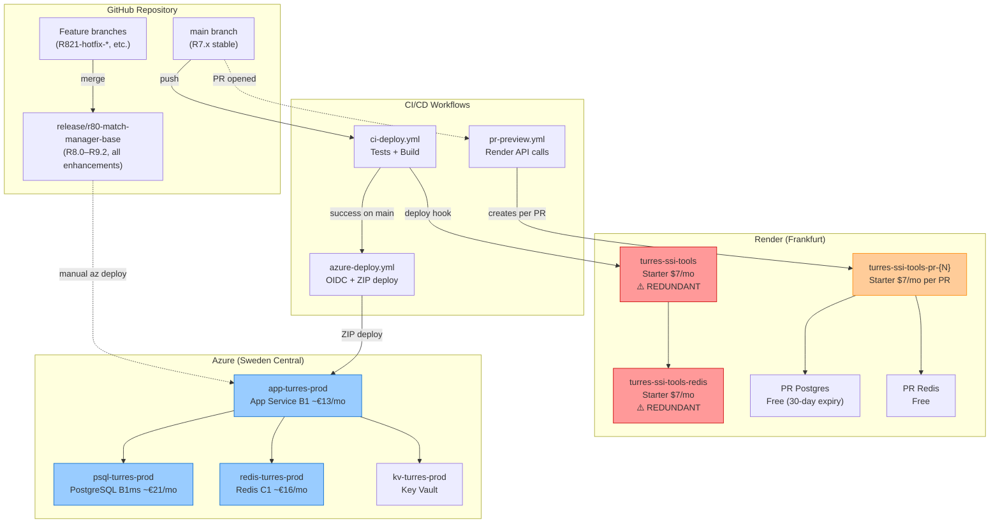
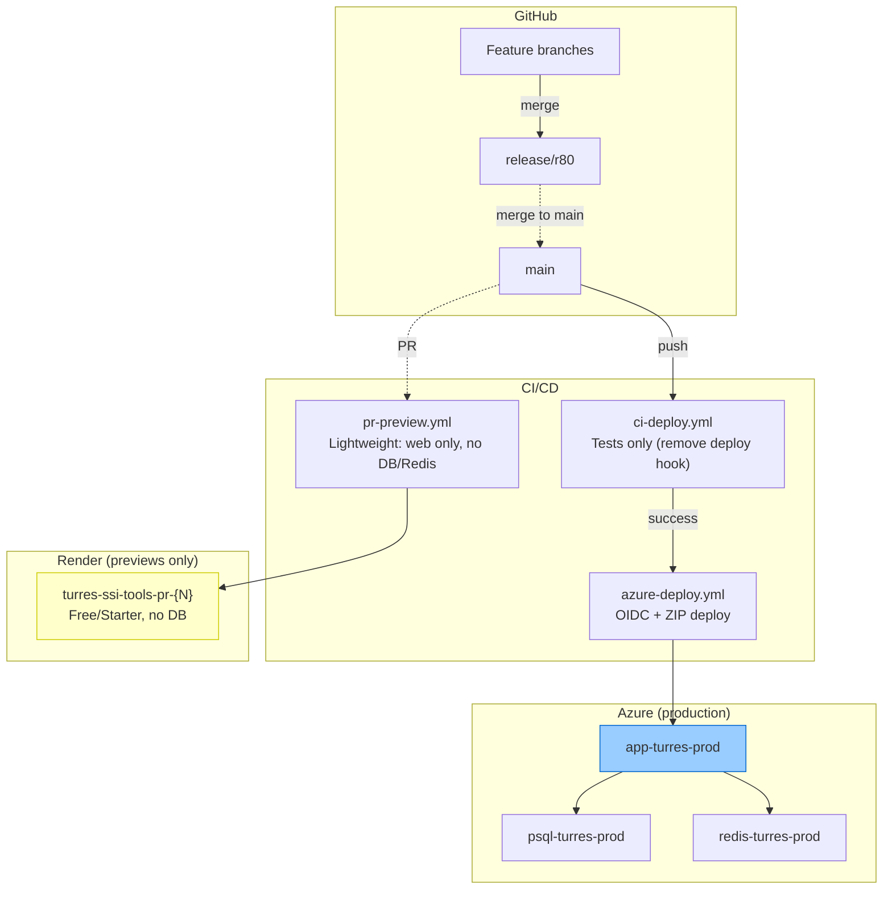

# Deployment Topology & Branch Strategy

**Last updated:** 2026-03-08

---

## Current Branch → Deployment Map

---

## Cost Summary (Current — Dual Deployment)

| Platform | Resource | Monthly Cost | Notes |
|----------|----------|-------------|-------|
| **Azure** | App Service B1 | ~€13 | Stopped when idle |
| **Azure** | PostgreSQL B1ms | ~€21 | Stopped when idle (~€4 storage only) |
| **Azure** | Redis C1 | ~€16 | Always running |
| **Azure** | KV + Logs | ~€1 | Negligible |
| **Render** | Production web | $7 (~€6.50) | ⚠️ **Redundant** — same app runs on Azure |
| **Render** | Production Redis | $7 (~€6.50) | ⚠️ **Redundant** — sessions on Azure |
| **Render** | Per-PR preview web | $7 (~€6.50) | Per active PR |
| **Render** | Per-PR Postgres | $0 | Free tier, **expires after 30 days** |
| **Render** | Per-PR Redis | $0 | Free tier |
| **Total running** | | **~€70/mo** | Azure + Render overlap |
| **Total stopped** | | **~€46/mo** | Azure stopped + Render still running |

---

## Problem: PR Preview Environments

The `pr-preview.yml` workflow triggers on every PR to `main` and provisions:
1. **Web service** (Starter plan, $7/mo) — runs until PR is closed
2. **PostgreSQL** (Free, 30-day expiry) — will become paid when Render drops free tier
3. **Redis** (Free) — will become paid when Render drops free tier

**Issues observed:**
- Previews sometimes fail to build/deploy (wasted cost)
- Stale previews persist (e.g., PR-138 is still running)
- Free Postgres expires after 30 days, breaking long-lived PRs
- Each PR costs **$7/mo minimum** even if never actually tested
- Production on Render is **redundant** now that Azure is the primary

---

## Proposed Options

### Option A: Remove Render Production, Keep Lightweight PR Previews (Recommended)

**Changes:**
1. **Delete** Render production web service + Redis ($14/mo saved)
2. **Simplify** PR previews: web service only (no Postgres, no Redis)
   - App works without DB (platform login disabled, scoring still works)
   - App works without Redis (falls back to in-memory sessions)
3. **Use Free tier** for PR previews (sleeps after 15min — acceptable for review)
4. Remove `RENDER_DEPLOY_HOOK` from `ci-deploy.yml` (Azure is primary)

**Cost:** Azure ~€50/mo running (~€25 stopped) + $0 Render free previews = **~€50/mo running**

### Option B: Remove Render Entirely

**Changes:**
- Delete all Render resources
- No PR preview environments
- Test changes manually or via Azure staging slot (requires P-tier, expensive)
- Or: run locally for testing

**Cost:** Azure only ~€50/mo running (~€25 stopped)
**Downside:** No way to share a live preview URL for PR review

### Option C: Keep Render as Primary, Remove Azure

**Changes:**
- Revert to Render-only deployment
- No auto-stop capability (Render always runs)
- PostgreSQL and Redis will become paid soon

**Cost:** ~$21/mo now, ~$35/mo when free tiers expire
**Downside:** No Entra ID auth, no auto-stop, weaker security model

---

## Recommendation: Option A

1. **Delete** Render production resources (web + Redis) — saves $14/mo immediately
2. **Simplify** `pr-preview.yml` to deploy **web-only on Free tier** (no DB/Redis provisioning)
3. **Remove** deploy hook from `ci-deploy.yml` (line 101-108)
4. **Clean up** stale PR-138 preview and databases
5. **Azure remains primary** with auto-stop scripts for cost management

**Resulting cost:**
- Running: ~€50/mo (Azure only)
- Stopped: ~€25/mo (Azure stopped)
- PR previews: $0 (Render Free tier)
