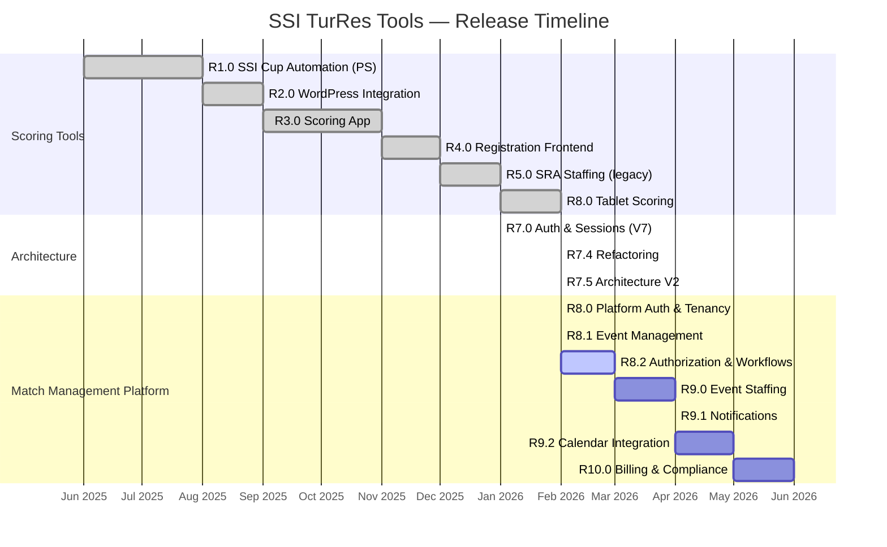
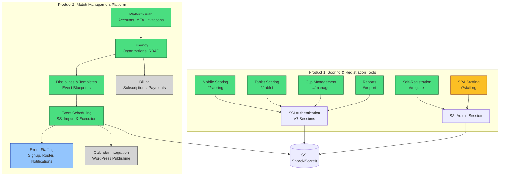
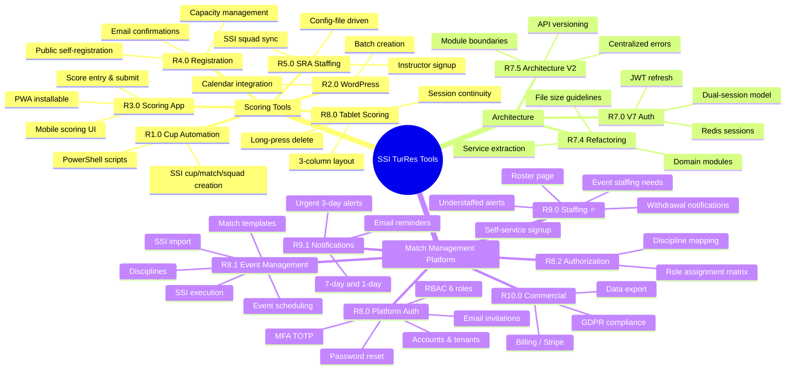

# Product Roadmap — Version History & Feature Map

**Date:** 2026-03-01

---

## Release Timeline

## Feature Architecture — Two Products

**Legend:** 🟢 Done | 🔵 In Progress | ⚪ Planned | 🟡 Legacy (to be migrated)

## Version Feature Map

## Product Separation Decision

The scoring and registration tools (#/scoring, #/tablet, #/register, #/manage, #/staffing) are **discipline-specific tools** — they work directly with SSI using SSI credentials and are designed for on-range use.

The Match Management Platform (#/platform) is a **multi-tenant organization tool** — it manages people, events, and staffing across disciplines.

### Recommendation: Keep in same deployment, separate UI routes

| Aspect | Scoring Tools | Match Management Platform |
|--------|--------------|--------------------------|
| **Users** | Scorers at the range | Club admins, instructors |
| **Auth** | SSI credentials (email+password+apiKey) | Platform accounts (email+password+MFA) |
| **Data** | SSI is source of truth | PostgreSQL + SSI references |
| **Context** | During competition | Before/after competition |
| **Routes** | #/scoring, #/tablet, #/register, #/manage | #/platform/* |

They share:
- Same Express server (single Render service)
- Same SSI integration layer (ssi-core/)
- Same Redis instance

But they are **logically separate products** with different auth systems, different users, and different lifecycle. The current architecture already reflects this — separate route files, separate API clients, separate UI component trees.

The SRA staffing feature (#/staffing) is the bridge — it's a legacy single-site staffing tool that should be **migrated into the platform's staffing feature** (Roster page). After migration, #/staffing can be deprecated.
