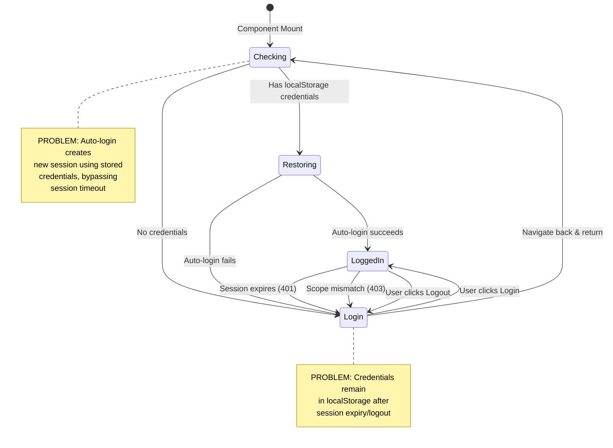
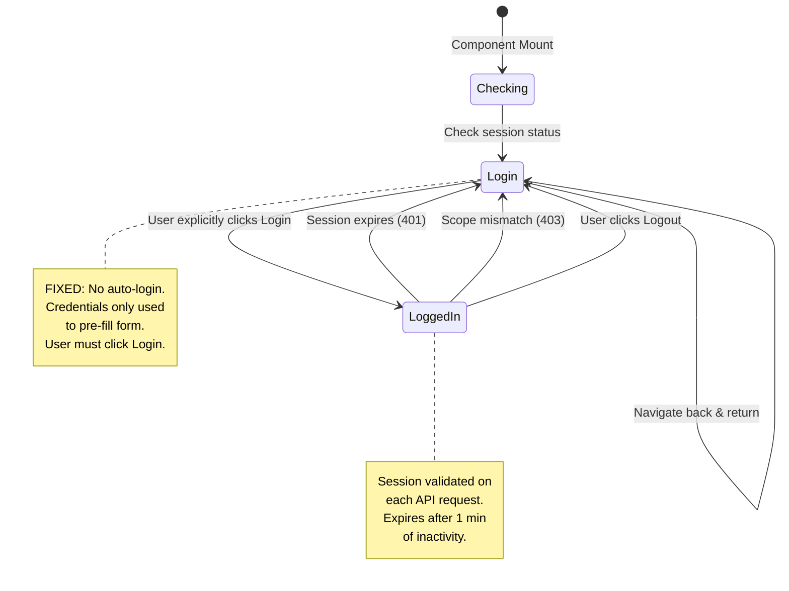

# Session Lifecycle State Chart

## Current State Flow (PROBLEMATIC)

## Problem Analysis

### Issue 1: Auto-login After Session Expiry
**Current behavior:**
1. User logs in with "Remember me" → credentials stored in localStorage
2. Session expires after 1 minute → user redirected to login
3. User navigates to home and back to feature
4. `useEffect` runs → auto-login with stored credentials → **NEW SESSION CREATED**
5. User appears to still be logged in (session wasn't really cleared)

**Root cause:** `localStorage` credentials persist after session expiry, allowing auto-login to recreate session.

### Issue 2: Auto-login After Logout
**Current behavior:**
1. User clicks "Sign out" → session cleared on server
2. Cookie cleared on client
3. User redirected to login
4. But credentials remain in localStorage!
5. Navigate away and back → auto-login creates **NEW SESSION**

**Root cause:** Logout doesn't clear localStorage credentials.

### Issue 3: Scope Mismatch Auto-Re-login
**Current behavior:**
1. User logs into scoring (scope: 'scoring')
2. Tries to access manage → 403 scope mismatch
3. Redirected to manage login page
4. But auto-login runs with stored credentials (wrong scope)
5. Auto-login creates 'manage' session → user is logged in without clicking login!

**Root cause:** Auto-login doesn't respect that user was logged out due to security (session expiry/scope mismatch).

## Solution: Explicit Login Required

### Fixed State Flow

### Key Changes

1. **Remove auto-login logic** - No automatic session creation on mount
2. **Only pre-fill credentials** - Remember me only fills the form, doesn't log in
3. **Explicit login required** - User must always click "Login" button
4. **Session-only authentication** - Only the server-side session cookie determines auth state
5. **No localStorage session state** - localStorage is only for remembering credentials to pre-fill

## Implementation Changes Required

### Backend (No changes needed)
- ✅ Sessions already expire after 1 minute inactivity
- ✅ Logout already clears session cookie
- ✅ Scope validation already working

### Frontend Changes

#### App.jsx (Scoring)
- ❌ Remove `tryAutoLogin` useEffect
- ✅ Keep credential pre-fill for form
- ✅ Only login on explicit button click
- ❌ Remove 'restoring' view state
- ✅ Start with 'login' view if not authenticated

#### ManagePage.jsx
- ❌ Remove `tryAutoLogin` useEffect  
- ❌ Remove 'checking' view state
- ✅ Start with 'login' view
- ✅ Only login on explicit button click

#### ReportPage.jsx & SummaryReportPage.jsx
- ❌ Remove `tryAutoLogin` useEffect
- ❌ Remove 'checking' view state
- ✅ Start with 'login' view
- ✅ Only login on explicit button click

## Benefits of Fixed Flow

1. **Clear session boundaries** - Session only exists when explicitly created by login button
2. **Session expiry actually works** - No auto-recreation after expiry
3. **Logout is complete** - No surprise re-login after logout
4. **Security improved** - User must explicitly authenticate for each session
5. **Predictable behavior** - Session state only managed server-side via cookie
6. **Remember me is safe** - Only pre-fills form, doesn't bypass authentication

## Testing Scenarios

After fix, verify:

1. ✅ Login with "remember me" → logout → navigate away & back → **must click Login**
2. ✅ Login → wait 1 minute → make request → **session expired, must login again**
3. ✅ Login to scoring → try manage → **scope mismatch, must login to manage**
4. ✅ Close browser → reopen → navigate to feature → **credentials pre-filled but must click Login**
5. ✅ Login → refresh page → **session valid via cookie, no login needed** (within 1 min)
