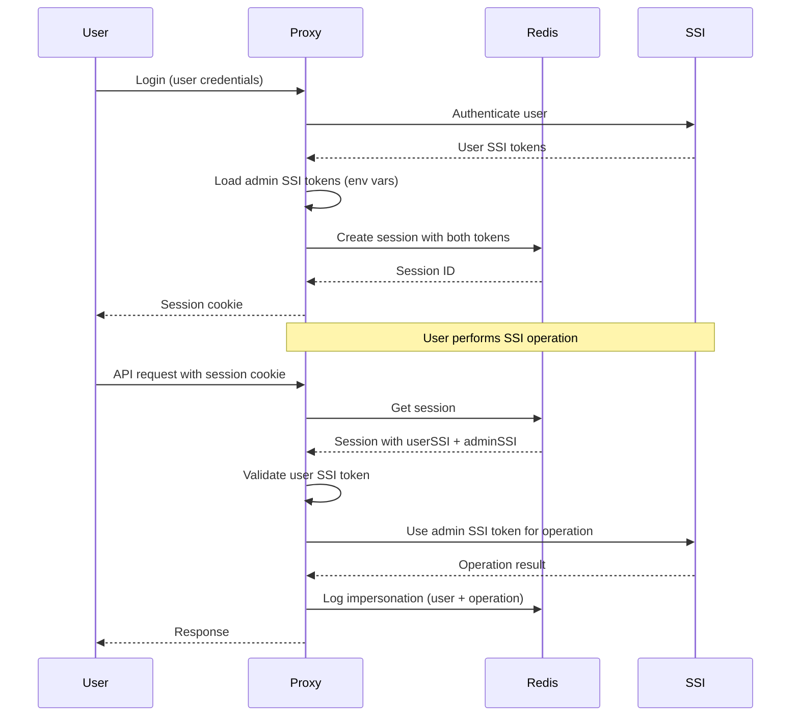

# V7.0 Authentication and Session Handling Design

**Document Version**: 1.0  
**Date**: 2026-02-12  
**Author**: System Architecture Team  
**Status**: Design Specification  

---

## Executive Summary

This document defines the V7.0 authentication and session handling architecture for the SSI Scoring system, implementing a secure dual-session pattern with impersonation capabilities. The design addresses critical security vulnerabilities in the current system while providing excellent user experience through automatic token refresh and state restoration.

**Key Innovation**: Dual-session architecture that securely binds admin SSI tokens to user sessions, preventing privilege escalation while enabling seamless impersonation for SSI operations.

---

## Architecture Overview

### Dual-Session Pattern

```mermaid
┌──────────────────────────────────────────────────┐
│           Client (Browser/PWA)                    │
│                                                   │
│  • Cookie: ssi_session (HttpOnly, 8h)            │
│  • localStorage: navigation state                 │
│  • localStorage: encrypted credentials (optional)   │
│  • Automatic SSI token refresh in background      │
└───────────────────┬───────────────────────────────┘
                    │ Cookie: ssi_session=<uuid>
          ┌─────────▼─────────────┐
          │  scoring-proxy (Node)  │
          │                        │
          │  • express-session    │
          │  • Redis store         │
          │  • Impersonation layer │
          │  • SSI token manager   │
          │  • Audit logging       │
          └────────┬────────────────┘
                   │
          ┌────────▼────────────────┐
          │   Redis (Session Store)  │
          │                         │
          │   ssi_sessions:         │
          │   • sessionId (PK)      │
          │   • userId              │
          │   • userSSI             │
          │   • adminSSI            │
          │   • scope               │
          │   • metadata            │
          │   • expiresAt           │
          └─────────────────────────┘
```

### Session Data Structure

```javascript
// Redis: ssi_sessions:{sessionId}
{
  userId: "user@example.com",
  userSSI: {
    jwt: "eyJhbGciOiJIUzI1NiIs...",
    refreshToken: "refresh_token_abc123",
    expiresAt: 1707665900,
    lastRefreshed: 1707665000
  },
  adminSSI: {
    jwt: "eyJhbGciOiJIUzI1NiIs...",
    refreshToken: "admin_refresh_xyz789",
    expiresAt: 1707670000,
    lastRefreshed: 1707665000
  },
  scope: "scoring manage reporting",
  metadata: {
    ipAddress: "203.0.113.45",
    userAgent: "Mozilla/5.0...",
    deviceFingerprint: "abc123...",
    loginTime: 1707665000,
    lastActivity: 1707666000
  },
  createdAt: 1707665000,
  expiresAt: 1707690000, // 8 hours from login
  lastUsed: 1707666000
}
```

---

## Security Architecture

### Impersonation Security Model



### Security Controls

| Control | Implementation | Purpose |
|---------|----------------|---------|
| **Session Isolation** | Each session contains isolated admin delegation | Prevent cross-user admin access |
| **User Token Validation** | User SSI token validated on each request | Ensure user context is valid |
| **Admin Token Binding** | Admin token only accessible with valid session | Prevent direct admin access |
| **Audit Trail** | All SSI operations logged with user context | Security monitoring |
| **Rate Limiting** | Express-rate-limit with Redis store | Prevent brute force attacks |
| **Session Revocation** | Immediate Redis key deletion on logout | Fast session termination |
| **CSRF Protection** | SameSite=Lax + CSRF tokens | Prevent cross-site requests |

---

## Component Design

### 1. Session Store Module

```javascript
// lib/session/store.js
import session from 'express-session'
import RedisStore from 'connect-redis'
import redis from './redis.js'
import crypto from 'crypto'

export class SessionStore {
  constructor() {
    this.store = RedisStore.create({
      client: redis,
      prefix: 'ssi_sessions:',
      ttl: 8 * 60 * 60, // 8 hours
      scanCount: 100,
      serialize: {
        transform: (session) => JSON.stringify(session),
        parse: (session) => JSON.parse(session)
      }
    })
  }

  createSession(userId, userSSI, scope = 'default') {
    const sessionId = crypto.randomUUID()
    const adminSSI = this.loadAdminSSI()
    
    const sessionData = {
      userId,
      userSSI: {
        ...userSSI,
        lastRefreshed: Date.now()
      },
      adminSSI: {
        ...adminSSI,
        lastRefreshed: Date.now()
      },
      scope,
      metadata: {
        loginTime: Date.now(),
        lastActivity: Date.now()
      },
      createdAt: Date.now(),
      expiresAt: Date.now() + (8 * 60 * 60 * 1000),
      lastUsed: Date.now()
    }
    
    return { sessionId, sessionData }
  }

  async refreshSSITokens(sessionId) {
    const session = await this.getSession(sessionId)
    if (!session) return null
    
    const now = Date.now()
    let updated = false
    
    // Refresh user SSI token if expiring within 10 minutes
    if (session.userSSI.expiresAt < now + 600000) {
      try {
        session.userSSI = await ssiRefreshJWT(session.userSSI.refreshToken)
        session.userSSI.lastRefreshed = now
        updated = true
      } catch (error) {
        console.error('User SSI refresh failed:', error)
        // Don't fail session, let it expire naturally
      }
    }
    
    // Refresh admin SSI token if expiring within 10 minutes
    if (session.adminSSI.expiresAt < now + 600000) {
      try {
        session.adminSSI = await ssiRefreshJWT(session.adminSSI.refreshToken)
        session.adminSSI.lastRefreshed = now
        updated = true
      } catch (error) {
        console.error('Admin SSI refresh failed:', error)
        // Critical - admin token refresh failure
        throw new Error('Admin SSI token refresh failed')
      }
    }
    
    if (updated) {
      session.lastUsed = now
      await this.updateSession(sessionId, session)
    }
    
    return session
  }

  loadAdminSSI() {
    // Load from environment variables
    return {
      jwt: process.env.SSI_ADMIN_JWT,
      refreshToken: process.env.SSI_ADMIN_REFRESH_TOKEN,
      expiresAt: parseInt(process.env.SSI_ADMIN_EXPIRES_AT) || Date.now() + 3600000
    }
  }
}
```

### 2. Authentication Middleware

```javascript
// middleware/auth.js
import rateLimit from 'express-rate-limit'

const loginRateLimit = rateLimit({
  windowMs: 15 * 60 * 1000, // 15 minutes
  max: 10, // 10 attempts per IP
  message: { error: 'Too many login attempts' },
  standardHeaders: true,
  legacyHeaders: false,
  keyGenerator: (req) => req.ip
})

export const requireAuth = async (req, res, next) => {
  const sessionId = req.cookies.ssi_session
  if (!sessionId) {
    return res.status(401).json({ error: 'Authentication required' })
  }
  
  try {
    const session = await sessionStore.refreshSSITokens(sessionId)
    if (!session || session.expiresAt < Date.now()) {
      res.clearCookie('ssi_session')
      return res.status(401).json({ error: 'Session expired' })
    }
    
    // Validate user SSI token
    if (session.userSSI.expiresAt < Date.now()) {
      return res.status(401).json({ error: 'User SSI token expired' })
    }
    
    req.session = session
    req.impersonation = {
      user: session.userId,
      userSSI: session.userSSI,
      adminSSI: session.adminSSI,
      scope: session.scope
    }
    
    next()
  } catch (error) {
    console.error('Auth middleware error:', error)
    res.status(500).json({ error: 'Authentication error' })
  }
}

export const requireScope = (requiredScope) => {
  return (req, res, next) => {
    if (!req.impersonation.scope.includes(requiredScope)) {
      return res.status(403).json({ error: 'Insufficient permissions' })
    }
    next()
  }
}
```

### 3. Impersonation Layer

```javascript
// lib/impersonation.js
import audit from './audit.js'

export class ImpersonationLayer {
  async executeSSIOperation(operation, userContext, adminSSI) {
    const startTime = Date.now()
    
    try {
      // Validate user context
      if (!userContext || !userContext.userSSI || userContext.userSSI.expiresAt < Date.now()) {
        throw new Error('Invalid user context for impersonation')
      }
      
      // Execute SSI operation with admin token
      const result = await operation(adminSSI.jwt)
      
      // Log successful operation
      await audit.log('SSI_OPERATION', {
        user: userContext.user,
        operation: operation.name,
        success: true,
        duration: Date.now() - startTime,
        adminUsed: true,
        userSSIValid: userContext.userSSI.expiresAt > Date.now()
      })
      
      return result
    } catch (error) {
      // Log failed operation
      await audit.log('SSI_OPERATION', {
        user: userContext?.user || 'unknown',
        operation: operation.name,
        success: false,
        error: error.message,
        duration: Date.now() - startTime
      })
      
      throw error
    }
  }
}

// Usage in routes
app.post('/api/scoring/score', requireAuth, requireScope('scoring'), async (req, res) => {
  const { adminSSI, userSSI, user } = req.impersonation
  
  const operation = {
    name: 'score_submit',
    execute: (adminToken) => ssiSubmitScore(adminToken, req.body)
  }
  
  try {
    const result = await impersonation.executeSSIOperation(operation, req.impersonation, adminSSI)
    res.json(result)
  } catch (error) {
    res.status(500).json({ error: 'Score submission failed' })
  }
})
```

### 4. Audit Logging

```javascript
// lib/audit.js
import crypto from 'crypto'

export class AuditLogger {
  async log(eventType, data) {
    const auditEntry = {
      id: crypto.randomUUID(),
      timestamp: new Date().toISOString(),
      eventType,
      data,
      server: process.env.HOSTNAME || 'unknown',
      version: process.env.APP_VERSION || 'unknown'
    }
    
    // Log to console (structured JSON)
    console.log(JSON.stringify(auditEntry))
    
    // Optionally store in Redis for audit trail
    if (process.env.AUDIT_REDIS === 'true') {
      await redis.lpush('audit_log', JSON.stringify(auditEntry))
      await redis.ltrim('audit_log', 0, 9999) // Keep last 10k entries
    }
  }
  
  async getAuditLog(filters = {}) {
    // Implementation for audit log retrieval
    // For admin dashboard or security monitoring
  }
}

export default new AuditLogger()
```

---

## Frontend Integration

### React Authentication Hook

```javascript
// src/hooks/useAuth.js
import { useQuery, useMutation, useQueryClient } from '@tanstack/react-query'

export function useAuth() {
  const queryClient = useQueryClient()
  
  const { data: user, error, isLoading } = useQuery({
    queryKey: ['auth', 'user'],
    queryFn: async () => {
      const resp = await fetch('/api/auth/me', { credentials: 'include' })
      if (resp.status === 401) throw new Error('Session expired')
      return resp.json()
    },
    retry: false,
    refetchInterval: 5 * 60 * 1000, // Check every 5 minutes
    staleTime: 4 * 60 * 1000 // Consider stale after 4 minutes
  })
  
  const login = useMutation({
    mutationFn: async (credentials) => {
      const resp = await fetch('/api/auth/login', {
        method: 'POST',
        credentials: 'include',
        headers: { 'Content-Type': 'application/json' },
        body: JSON.stringify(credentials)
      })
      if (!resp.ok) throw new Error('Login failed')
      return resp.json()
    },
    onSuccess: () => {
      queryClient.invalidateQueries({ queryKey: ['auth'] })
      // Restore any saved state
      restoreSavedState()
    }
  })
  
  const logout = useMutation({
    mutationFn: async () => {
      await fetch('/api/auth/logout', {
        method: 'POST',
        credentials: 'include'
      })
    },
    onSuccess: () => {
      queryClient.clear()
      clearSavedState()
    }
  })
  
  return { user, error, isLoading, login, logout }
}
```

### State Restoration

```javascript
// src/hooks/useStateRestoration.js
export function useStateRestoration() {
  const { error } = useAuth()
  
  useEffect(() => {
    if (error?.message === 'Session expired') {
      // Save current state before redirect
      const currentState = {
        route: window.location.hash,
        timestamp: Date.now(),
        data: gatherPageState(),
        scrollPosition: window.scrollY
      }
      sessionStorage.setItem('preExpiryState', JSON.stringify(currentState))
      
      // Redirect to login
      window.location.hash = '#/login'
      return
    }
    
    // Restore state after successful login
    const savedState = sessionStorage.getItem('preExpiryState')
    if (savedState && window.location.hash === '#/') {
      const state = JSON.parse(savedState)
      // Only restore if recent (within 30 minutes)
      if (Date.now() - state.timestamp < 30 * 60 * 1000) {
        restoreState(state)
        sessionStorage.removeItem('preExpiryState')
      }
    }
  }, [error])
  
  const gatherPageState = () => {
    // Collect page-specific state
    const state = {}
    
    if (window.location.hash.startsWith('#/scoring')) {
      state.scoring = {
        cupId: getCupIdFromURL(),
        matchId: getMatchIdFromURL(),
        squadId: getSquadIdFromURL(),
        shooterIndex: getShooterIndexFromURL()
      }
    }
    
    if (window.location.hash.startsWith('#/manage')) {
      state.manage = {
        cupId: getCupIdFromURL(),
        activeTab: getActiveTab()
      }
    }
    
    return state
  }
  
  const restoreState = (savedState) => {
    // Restore navigation
    if (savedState.route) {
      window.location.hash = savedState.route
    }
    
    // Restore scroll position
    if (savedState.scrollPosition) {
      setTimeout(() => window.scrollTo(0, savedState.scrollPosition), 100)
    }
    
    // Restore page-specific state
    if (savedState.data) {
      restorePageState(savedState.data)
    }
  }
  
  return null
}
```

---

## Security Considerations

### Threat Model Analysis

| Threat | Mitigation | Implementation |
|--------|------------|----------------|
| **Session Hijacking** | HttpOnly cookies, secure transmission | express-session configuration |
| **Privilege Escalation** | Admin token bound to user session | Impersonation layer validation |
| **Token Theft** | Short-lived tokens, automatic refresh | 15min user tokens, 8h sessions |
| **Replay Attacks** | Session IDs, CSRF protection | SameSite=Lax, CSRF tokens |
| **Session Fixation** | Session regeneration on login | express-session built-in |
| **Admin Token Exposure** | Server-side only, never in client | Environment variables only |
| **User Enumeration** | Generic error messages | Consistent error responses |
| **Brute Force** | Rate limiting, account lockout | express-rate-limit |

### OWASP Compliance Checklist

| OWASP Requirement | Implementation | Status |
|-------------------|----------------|---------|
| **Session IDs** | Cryptographically secure UUIDs | ✅ |
| **Session Transport** | HttpOnly, Secure, SameSite cookies | ✅ |
| **Session Timeout** | 8-hour inactivity timeout | ✅ |
| **Session Revocation** | Immediate Redis deletion | ✅ |
| **Session Fixation** | Regenerate on login | ✅ |
| **Concurrent Sessions** | Multiple per user allowed | ✅ |
| **Server-side Storage** | Redis with encryption | ✅ |
| **Logout** | Clears session + cookies | ✅ |
| **Idle Timeout** | 8-hour inactivity | ✅ |
| **Absolute Timeout** | 8-hour maximum | ✅ |

---

## Performance Considerations

### Redis Optimization

```javascript
// Connection pooling and optimization
const redis = createClient({
  url: process.env.REDIS_URL,
  socket: {
    reconnectStrategy: (retries) => {
      if (retries > 10) return new Error('Redis reconnection failed')
      return Math.min(retries * 100, 3000)
    },
    connectTimeout: 5000,
    lazyConnect: true
  },
  commands: {
    // Optimized session commands
    getSession: {
      transform: (key, value) => JSON.parse(value),
      parse: (key, value) => JSON.parse(value)
    }
  }
})

// Session lookup optimization
const SESSION_CACHE = new Map()
const CACHE_TTL = 5 * 60 * 1000 // 5 minutes

export async function getSessionOptimized(sessionId) {
  // Check cache first
  const cached = SESSION_CACHE.get(sessionId)
  if (cached && (Date.now() - cached.timestamp) < CACHE_TTL) {
    return cached.session
  }
  
  // Fetch from Redis
  const session = await redis.get(`ssi_sessions:${sessionId}`)
  if (session) {
    // Cache the result
    SESSION_CACHE.set(sessionId, {
      session: JSON.parse(session),
      timestamp: Date.now()
    })
    
    // Clean cache periodically
    if (SESSION_CACHE.size > 1000) {
      for (const [key, value] of SESSION_CACHE.entries()) {
        if (Date.now() - value.timestamp > CACHE_TTL) {
          SESSION_CACHE.delete(key)
        }
      }
    }
  }
  
  return session ? JSON.parse(session) : null
}
```

### Performance Targets

| Metric | Target | Measurement |
|--------|--------|-------------|
| **Session Lookup** | <50ms p95 | Redis query time |
| **Authentication** | <100ms p95 | Full auth flow |
| **Token Refresh** | <200ms p95 | SSI refresh call |
| **Concurrent Users** | 100 | Load testing |
| **Memory Usage** | <512MB | Redis + app memory |
| **CPU Usage** | <70% | Under load |

---

## Monitoring and Observability

### Key Metrics

```javascript
// lib/metrics.js
import prometheus from 'prom-client'

const sessionMetrics = {
  sessionActive: new prometheus.Gauge({
    name: 'ssi_sessions_active_total',
    help: 'Number of active sessions'
  }),
  
  sessionCreated: new prometheus.Counter({
    name: 'ssi_sessions_created_total',
    help: 'Total sessions created'
  }),
  
  sessionExpired: new prometheus.Counter({
    name: 'ssi_sessions_expired_total',
    help: 'Total sessions expired'
  }),
  
  authFailures: new prometheus.Counter({
    name: 'ssi_auth_failures_total',
    help: 'Total authentication failures'
  }),
  
  ssiOperations: new prometheus.Counter({
    name: 'ssi_operations_total',
    help: 'Total SSI operations',
    labelNames: ['operation', 'status']
  }),
  
  tokenRefreshes: new prometheus.Counter({
    name: 'ssi_token_refreshes_total',
    help: 'Total token refreshes',
    labelNames: ['token_type', 'status']
  })
}

export default sessionMetrics
```

### Health Checks

```javascript
// routes/health.js
app.get('/api/health', async (req, res) => {
  const health = {
    status: 'healthy',
    timestamp: new Date().toISOString(),
    version: process.env.APP_VERSION,
    checks: {
      redis: await checkRedisHealth(),
      ssi: await checkSSIHealth(),
      sessions: await checkSessionHealth()
    }
  }
  
  const isHealthy = Object.values(health.checks).every(check => check.status === 'healthy')
  res.status(isHealthy ? 200 : 503).json(health)
})

async function checkRedisHealth() {
  try {
    await redis.ping()
    return { status: 'healthy', latency: Date.now() }
  } catch (error) {
    return { status: 'unhealthy', error: error.message }
  }
}
```

---

## Migration Strategy

### Phase 0: Preparation (Week 0)

1. **Infrastructure Setup**
   - Deploy Redis instance
   - Configure environment variables
   - Set up monitoring

2. **Code Preparation**
   - Add dependencies (express-session, connect-redis)
   - Create feature flags
   - Prepare test fixtures

### Phase 1: Backend Implementation (Week 1-2)

1. **Session Store Implementation**
   - Create SessionStore class
   - Implement Redis integration
   - Add session middleware

2. **Authentication Layer**
   - Implement requireAuth middleware
   - Add impersonation layer
   - Create audit logging

3. **Testing**
   - Unit tests for session management
   - Integration tests for auth flows
   - Security tests for impersonation

### Phase 2: Frontend Integration (Week 3)

1. **React Integration**
   - Implement useAuth hook
   - Add state restoration
   - Update API client

2. **Testing**
   - Component tests for auth flows
   - E2E tests for complete journeys
   - Performance tests

### Phase 3: Migration (Week 4)

1. **Gradual Rollout**
   - Feature flag for new auth system
   - 10% users → 50% → 100%
   - Monitor metrics and errors

2. **Legacy Cleanup**
   - Remove old session code
   - Update documentation
   - Decommission old systems

---

## Success Criteria

### Functional Requirements

- ✅ Sessions persist across server restarts
- ✅ Automatic SSI token refresh
- ✅ Secure impersonation with audit trail
- ✅ State restoration after expiry
- ✅ Cross-feature authentication

### Security Requirements

- ✅ OWASP compliance
- ✅ No privilege escalation vulnerabilities
- ✅ Complete audit trail
- ✅ Rate limiting and protection

### Performance Requirements

- ✅ <50ms session lookup p95
- ✅ Support 100 concurrent users
- ✅ <1% authentication failures
- ✅ 99.9% uptime

### Testing Requirements

- ✅ 90% code coverage
- ✅ Security penetration testing
- ✅ Load testing validation
- ✅ Reliability testing

---

## References

1. **OWASP Session Management Cheat Sheet**  
   https://cheatsheetseries.owasp.org/cheatsheets/Session_Management_Cheat_Sheet.html

2. **Express Session Documentation**  
   https://github.com/expressjs/session

3. **Connect Redis Documentation**  
   https://github.com/tj/connect-redis

4. **React Query Documentation**  
   https://tanstack.com/query/latest

5. **Redis Security Best Practices**  
   https://redis.io/topics/security
