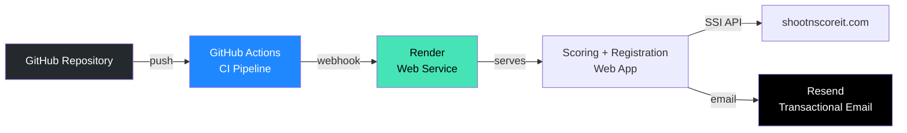

# Installation Guide

This guide covers deploying the SSI Kupittaa Cup application from scratch using GitHub, Render, and Resend.

## Architecture Overview



## 1. GitHub Setup

### Repository

1. Fork or clone the repository
2. The `main` branch is the production deploy branch

### GitHub Actions Secret

The CI pipeline needs one secret to trigger Render deploys:

1. Go to **Settings → Secrets and variables → Actions**
2. Add repository secret:

| Secret | Value |
|--------|-------|
| `RENDER_DEPLOY_HOOK` | Render deploy webhook URL (created in step 2) |

### CI Pipeline

The pipeline (`.github/workflows/ci-deploy.yml`) runs automatically on push:

```
Install → Test → Audit → Build → Deploy (via Render webhook)
```

No SSI credentials are needed in GitHub — the pipeline only builds, tests, and triggers Render.

## 2. Render Setup

### Create Web Service

1. Go to [render.com](https://render.com) and sign in
2. **New → Web Service**
3. Connect your GitHub repository
4. Configure:

| Setting | Value |
|---------|-------|
| **Name** | `ssi-scoring` |
| **Branch** | `main` |
| **Runtime** | Node |
| **Build Command** | `cd scoring-ui && npm install && npm run build && cd ../scoring-proxy && npm install` |
| **Start Command** | `cd scoring-proxy && node server.js` |

> These are also defined in `render.yaml` for infrastructure-as-code.

### Environment Variables

Set these in the Render dashboard under **Environment**:

| Variable | Value | Notes |
|----------|-------|-------|
| `NODE_ENV` | `production` | Already in render.yaml |
| `PORT` | `3001` | Already in render.yaml |
| `SSI_ADMIN_EMAIL` | *(your SSI admin email)* | **Secret** — set in dashboard only |
| `SSI_ADMIN_PASSWORD` | *(your SSI admin password)* | **Secret** — set in dashboard only |
| `SSI_ADMIN_API_KEY` | *(your SSI GraphQL API key)* | **Secret** — set in dashboard only |
| `RESEND_API_KEY` | *(your Resend API key)* | **Secret** — set in dashboard only |
| `EMAIL_FROM` | `Kupittaa CUP <no-reply@yourdomain.com>` | Optional, defaults to `onboarding@resend.dev` |
| `ALLOWED_ORIGINS` | *(your Render URL)* | Optional, defaults to the Render app URL |

> **Never commit secrets** to `render.yaml` or source code.

### Deploy Hook

1. In Render dashboard, go to your service → **Settings → Build & Deploy**
2. Copy the **Deploy Hook URL**
3. Add it as `RENDER_DEPLOY_HOOK` secret in GitHub (step 1)

### SSI Admin Account

The registration backend needs an SSI admin account to perform web scraping operations (adding participants, approving, assigning squads). This account must:

- Have admin access to the CUP events you want to manage
- Be a member of the managing group (e.g. group 25874 for Kupittaa)

## 3. Resend Setup (Email)

### Create Account

1. Go to [resend.com](https://resend.com) and sign up
2. Get your **API key** from the dashboard

### Domain Verification (recommended)

Without a verified domain, emails are sent from `onboarding@resend.dev` which may land in spam.

1. In Resend dashboard, go to **Domains → Add Domain**
2. Enter your domain (e.g. `ssi.yourdomain.com`)
3. Add the DNS records Resend provides:

| Type | Name | Value |
|------|------|-------|
| MX | `ssi.yourdomain.com` | *(provided by Resend)* |
| TXT | `ssi.yourdomain.com` | *(SPF record from Resend)* |
| CNAME | *(provided)* | *(DKIM record from Resend)* |

4. Wait for verification (usually minutes, can take up to 48h)
5. Update `EMAIL_FROM` in Render to use your verified domain

### Email Template

Confirmation emails are sent automatically after successful registration. They include:

- CUP name and date
- Match list with squad assignment per match
- Link to re-register (change squad)
- Link to SSI My Registrations (withdraw)

No template configuration is needed — the email content is generated by `scoring-proxy/lib/email.js`.

## 4. Verification

After deployment, verify each component:

### App Health

```
curl https://your-app.onrender.com/api/health
```

Expected: `{"status":"ok"}`

### Scoring App

1. Open `https://your-app.onrender.com`
2. Log in with SSI credentials
3. Search for a cup and navigate to a match

### Registration App

1. Open `https://your-app.onrender.com/#/register`
2. Solve the captcha
3. Verify cups load and squads display correctly
4. Test a registration with a known SSI email

### Email Delivery

1. Complete a test registration
2. Check inbox (and spam folder) for confirmation email
3. Verify sender address matches your `EMAIL_FROM` configuration

## 5. Local Development

```bash
# Clone and install
git clone <repo-url>
cd scoring-ui && npm install
cd ../scoring-proxy && npm install

# Create scoring-proxy/.env
SSI_ADMIN_EMAIL=your-email@example.com
SSI_ADMIN_PASSWORD=your-password
SSI_ADMIN_API_KEY=your-api-key
RESEND_API_KEY=re_your_key

# Start (serves UI + API on port 3001)
cd .. && node --env-file=scoring-proxy/.env scoring-proxy/server.js

# Or with UI hot-reload (two terminals)
cd scoring-ui && npm run dev        # Vite dev server on :5173
cd scoring-proxy && node server.js  # API on :3001
```

### Running Tests

```bash
# Backend tests (registration endpoints, rate limiting, validation)
cd scoring-proxy && npx vitest run

# Frontend tests (API client unit tests)
cd scoring-ui && npm test
```
