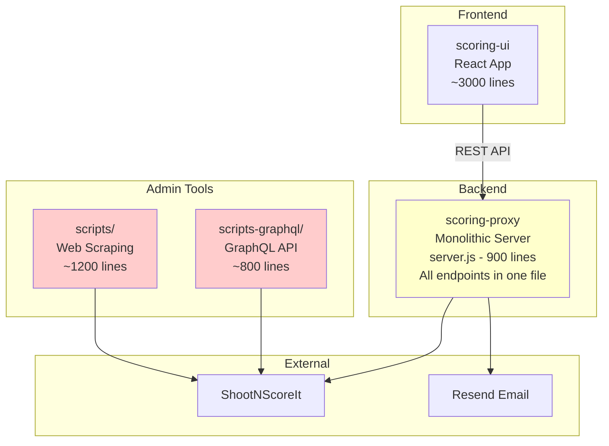
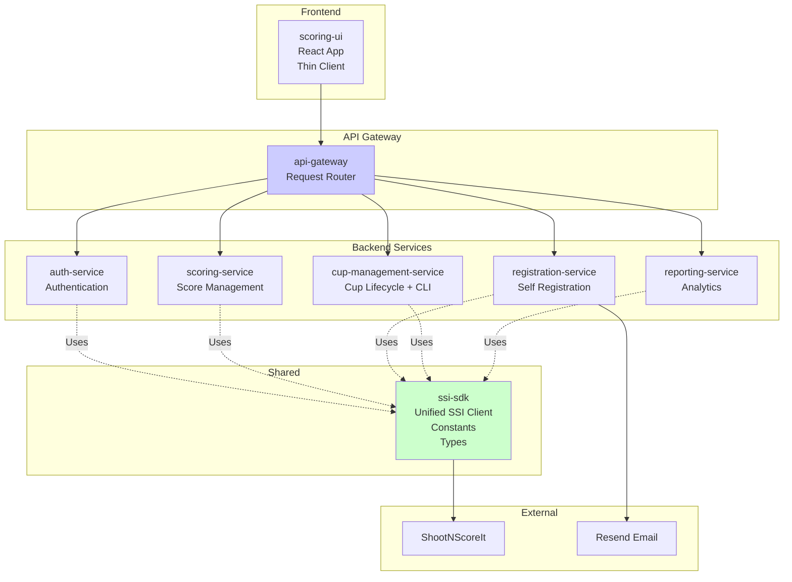

# Refactoring Plan - Visual Summary

**Quick Reference Guide for Stakeholders**

---

## Current vs. Proposed Architecture

### Current Architecture



**Issues:**
- 🔴 Two cup creation implementations (scripts vs scripts-graphql)
- 🔴 900-line monolithic server.js
- 🔴 Duplicated constants (SCORE_ZONES in UI and proxy)
- 🔴 No shared library for SSI operations

---

### Proposed Architecture (Alternative 2 - Recommended)



**Benefits:**
- ✅ Single cup creation implementation (in cup-management-service)
- ✅ Small, focused services (100-200 lines each)
- ✅ Shared constants in ssi-sdk
- ✅ Reusable SSI library across all services

---

## Comparison at a Glance

| Aspect | Current | After Refactoring |
|--------|---------|-------------------|
| **Cup Creation Scripts** | 2 implementations (2,000 lines) | 1 implementation (400 lines) |
| **Largest File** | server.js (900 lines) | Any service (~200 lines) |
| **Constants** | Duplicated in 2+ places | Single source (ssi-sdk) |
| **SSI Integration** | 3+ implementations | 1 shared SDK |
| **Token Consumption** | ~4,000 tokens/task | ~600 tokens/task (85% savings) |
| **Deployment** | 2 apps (UI + Proxy) | 6 services (scalable) |
| **Testing** | Mixed (hard to isolate) | Per-service (easy isolation) |

---

## Token Consumption Impact

### Example: "Update Score Zones"

**Current:**
```
Agent must load:
- scoring-ui/src/App.jsx (500 lines)
- scoring-proxy/server.js (900 lines)
Total: ~4,000 tokens
```

**After Refactoring:**
```
Agent loads only:
- packages/ssi-sdk/src/constants.js (50 lines)
Total: ~200 tokens (95% savings)
```

### Example: "Add New API Endpoint"

**Current:**
```
Agent must load:
- scoring-proxy/server.js (900 lines + all imports)
- scoring-ui/src/api.js (200 lines)
Total: ~3,500 tokens
```

**After Refactoring:**
```
Agent loads only:
- packages/scoring-service/src/routes/scoring.js (100 lines)
- apps/scoring-ui/src/services/scoring-api.js (80 lines)
Total: ~800 tokens (77% savings)
```

### Overall Impact

| Task Category | Current Avg | Refactored Avg | Savings |
|---------------|-------------|----------------|---------|
| Add endpoint | 3,500 tokens | 800 tokens | 77% |
| Update constants | 4,000 tokens | 200 tokens | 95% |
| Fix bug | 3,000 tokens | 600 tokens | 80% |
| Add feature | 5,000 tokens | 1,200 tokens | 76% |
| **Average** | **3,875 tokens** | **700 tokens** | **82%** |

**Translation:** For a 100-task project, refactoring saves ~320,000 tokens (~$5-10 in API costs, plus faster development).

---

## File Size Reduction

### Before Refactoring

```
scoring-proxy/server.js
├─ Lines: 900
├─ Concerns: 7 (auth, scoring, registration, reports, cups, management, health)
└─ Token cost per edit: ~3,000

scoring-ui/src/App.jsx
├─ Lines: 500
├─ Concerns: 8 (login, navigation, scoring, state management, persistence)
└─ Token cost per edit: ~1,500
```

### After Refactoring

```
packages/scoring-service/src/
├─ routes/scoring.js (100 lines)
├─ session/manager.js (80 lines)
├─ validation/validator.js (60 lines)
└─ Token cost per edit: ~300-500

packages/registration-service/src/
├─ routes/registration.js (120 lines)
├─ captcha/handler.js (50 lines)
├─ email/templates.js (70 lines)
└─ Token cost per edit: ~200-400

apps/scoring-ui/src/
├─ pages/ScoringPage.jsx (150 lines)
├─ pages/RegistrationPage.jsx (180 lines)
├─ hooks/useScoring.js (80 lines)
└─ Token cost per edit: ~400-600
```

**Average file size:** 900 lines → 100 lines (89% reduction)

---

## Two Alternative Approaches

### Alternative 1: Consolidation with Shared Utilities

**Timeline:** 2-3 weeks  
**Complexity:** Low  
**Risk:** Low  

**What it does:**
- ✅ Creates shared `ssi-sdk` package for common code
- ✅ Consolidates cup creation scripts (removes duplication)
- ✅ Splits server.js into route modules
- ❌ Keeps proxy as monolithic service

**Good for:**
- Small teams
- Limited resources
- Quick improvements
- Maintaining current deployment

**Score:** 3.6/5

---

### Alternative 2: Modular Microservice Architecture ⭐ RECOMMENDED

**Timeline:** 7-10 weeks (phased)  
**Complexity:** Medium-High  
**Risk:** Medium (mitigated by phased rollout)  

**What it does:**
- ✅ Creates comprehensive `ssi-sdk` (TypeScript)
- ✅ Splits proxy into 5 independent services
- ✅ Implements API gateway
- ✅ Professional CLI tools (replaces PowerShell)
- ✅ Docker + Kubernetes deployment

**Good for:**
- Long-term maintainability
- Team scalability
- Professional quality
- Token efficiency (85% savings)

**Score:** 4.3/5

---

## Phased Implementation

### Phase 1: Quick Wins (Weeks 1-3)

**Goal:** Eliminate redundancies

```
✅ Create ssi-sdk package
✅ Consolidate cup creation (remove scripts/)
✅ Update UI and proxy to use shared SDK
```

**Deliverable:** Single source of truth, 50% duplication removed

---

### Phase 2: Service Extraction (Weeks 4-6)

**Goal:** Split monolithic proxy

```
✅ Create scoring-service
✅ Create registration-service
✅ Create cup-management-service
✅ Create api-gateway
✅ Docker development environment
```

**Deliverable:** Independent services, 70% token savings

---

### Phase 3: Production Readiness (Weeks 7-10)

**Goal:** Deploy to production

```
✅ Kubernetes deployment
✅ Monitoring (logs, traces, metrics)
✅ CI/CD pipelines
✅ Complete documentation
```

**Deliverable:** Production-ready microservices, 85% token savings

---

## Code Example: Before vs. After

### Updating Score Zones

**Before (Alternative 0 - Current):**

```javascript
// File: scoring-ui/src/App.jsx (line 15)
const SCORE_ZONES = ['X', '10', '9', '8', '7', '6', '5', '4', '3', '2', '1', 'M'];

// File: scoring-proxy/server.js (line 80)
const ZONES = ['X', '10', '9', '8', '7', '6', '5', '4', '3', '2', '1', 'M'];
```

**Problem:** Must update in 2 places, easy to forget one

---

**After (Alternative 1 - Consolidation):**

```javascript
// File: packages/ssi-core/src/constants.js
export const SCORE_ZONES = ['X', '10', '9', '8', '7', '6', '5', '4', '3', '2', '1', 'M'];

// File: scoring-ui/src/App.jsx
import { SCORE_ZONES } from '@ssi-integrator/ssi-core';

// File: scoring-proxy/server.js
import { SCORE_ZONES } from '@ssi-integrator/ssi-core';
```

**Benefit:** Single update point, guaranteed consistency

---

**After (Alternative 2 - Microservices):**

```typescript
// File: packages/ssi-sdk/src/constants.ts (TypeScript)
export const SCORE_ZONES = ['X', '10', '9', '8', '7', '6', '5', '4', '3', '2', '1', 'M'] as const;

export type ScoreZone = typeof SCORE_ZONES[number];
// ScoreZone type = 'X' | '10' | '9' | ... | 'M'

// File: apps/scoring-ui/src/App.tsx
import { SCORE_ZONES, ScoreZone } from '@ssi-integrator/ssi-sdk';

function validateScore(score: ScoreZone) {
  // TypeScript ensures score is valid at compile time
}

// File: packages/scoring-service/src/validation/validator.ts
import { SCORE_ZONES, ScoreZone } from '@ssi-integrator/ssi-sdk';
```

**Additional Benefit:** Type safety prevents runtime errors

---

## Resource Requirements

### Alternative 1: Consolidation

**Development:**
- 1 developer, 2-3 weeks full-time
- Node.js experience required
- Basic NPM workspaces knowledge

**Infrastructure:**
- No changes to current deployment
- Same hosting (Render or similar)

**Maintenance:**
- Slightly reduced (less duplication)

---

### Alternative 2: Microservices

**Development:**
- 2-3 developers, 7-10 weeks combined
- Node.js, TypeScript experience required
- Docker, Kubernetes knowledge needed

**Infrastructure:**
- Container orchestration (Kubernetes)
- Load balancer for API gateway
- Monitoring stack (logs, metrics, traces)
- CI/CD pipelines

**Maintenance:**
- Significantly reduced (modular, isolated services)
- Easier onboarding (smaller codebases)

---

## Risk Assessment

### Alternative 1: Low Risk

| Risk | Likelihood | Impact | Mitigation |
|------|------------|--------|------------|
| Breaking changes during refactor | Low | Medium | Comprehensive testing |
| NPM workspace issues | Low | Low | Well-documented pattern |
| Adoption resistance | Low | Low | Minimal workflow changes |

---

### Alternative 2: Medium Risk

| Risk | Likelihood | Impact | Mitigation |
|------|------------|--------|------------|
| Service orchestration complexity | Medium | High | Phased rollout, Docker Compose first |
| Network latency between services | Low | Medium | Co-locate services, use caching |
| Debugging distributed systems | Medium | Medium | Centralized logging, distributed tracing |
| Team learning curve | Medium | Medium | Training, documentation, pair programming |
| Deployment complexity | Medium | High | Infrastructure as Code, automated pipelines |

**Overall Risk Level:** Acceptable with proper planning and phased approach

---

## Success Metrics

### Phase 1 Success Criteria

- [ ] ssi-sdk package published and used by UI + proxy
- [ ] Single cup creation script (scripts-graphql only)
- [ ] All existing tests pass
- [ ] No regressions in functionality

### Phase 2 Success Criteria

- [ ] 5 services running independently in Docker
- [ ] API gateway routing correctly
- [ ] Token consumption reduced by 70%+
- [ ] Service response time < 300ms (p95)

### Phase 3 Success Criteria

- [ ] Production deployment on Kubernetes
- [ ] Zero-downtime deployments working
- [ ] Monitoring dashboards operational
- [ ] Developer satisfaction score > 8/10
- [ ] Token consumption reduced by 85%+

---

## Return on Investment (ROI)

### Alternative 1: High ROI, Quick Payback

**Investment:**
- 120-160 hours (3-4 weeks)
- ~$15,000-20,000 (developer time)

**Returns:**
- 50% less code duplication → easier maintenance
- 40% faster bug fixes (smaller files)
- 50% token savings → $200-500/year (AI costs)

**Payback period:** 6-12 months

---

### Alternative 2: Very High ROI, Longer Payback

**Investment:**
- 400-600 hours (7-10 weeks)
- ~$50,000-75,000 (developer time + infrastructure)

**Returns:**
- 85% token savings → $800-1,500/year (AI costs)
- 60% faster feature development (isolation)
- 70% faster onboarding (smaller codebases)
- Independent scaling → handle 10x load without rewrite

**Payback period:** 18-24 months

**Long-term value:** Avoids future rewrite (estimated $150,000+ saved)

---

## Recommendation Summary

✅ **Recommended:** Alternative 2 (Microservices) with phased approach

**Why:**
1. **Eliminates all identified issues** (not just some)
2. **Massive token savings** (85% vs 50%)
3. **Future-proof architecture** (scales with team and usage)
4. **Industry best practices** (professional quality)
5. **Phased rollout** (mitigates risk, delivers incremental value)

**Start with Phase 1 to get quick wins, then proceed to Phases 2-3 for full benefits.**

---

## Next Steps

1. **Review this plan** with stakeholders
2. **Approve chosen alternative** (1 or 2)
3. **Allocate resources** (developers, infrastructure)
4. **Create implementation tickets** from roadmap
5. **Begin Phase 1** development

**Questions?** See full details in `docs/refactoring-plan.md`

---

**Document Version:** 1.0  
**Last Updated:** 2026-02-08  
**Status:** Proposed
