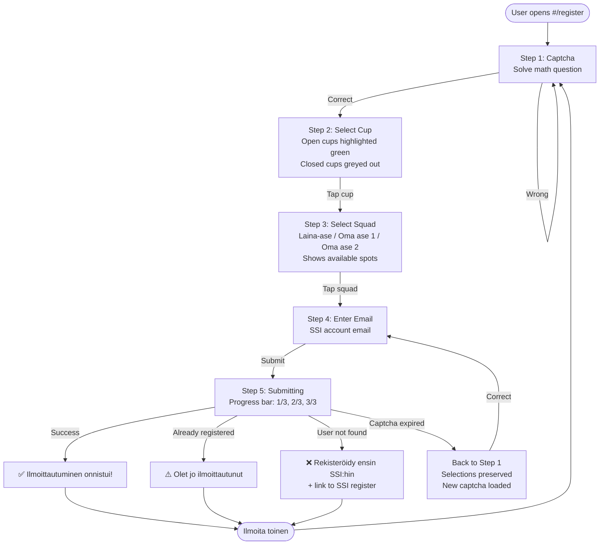
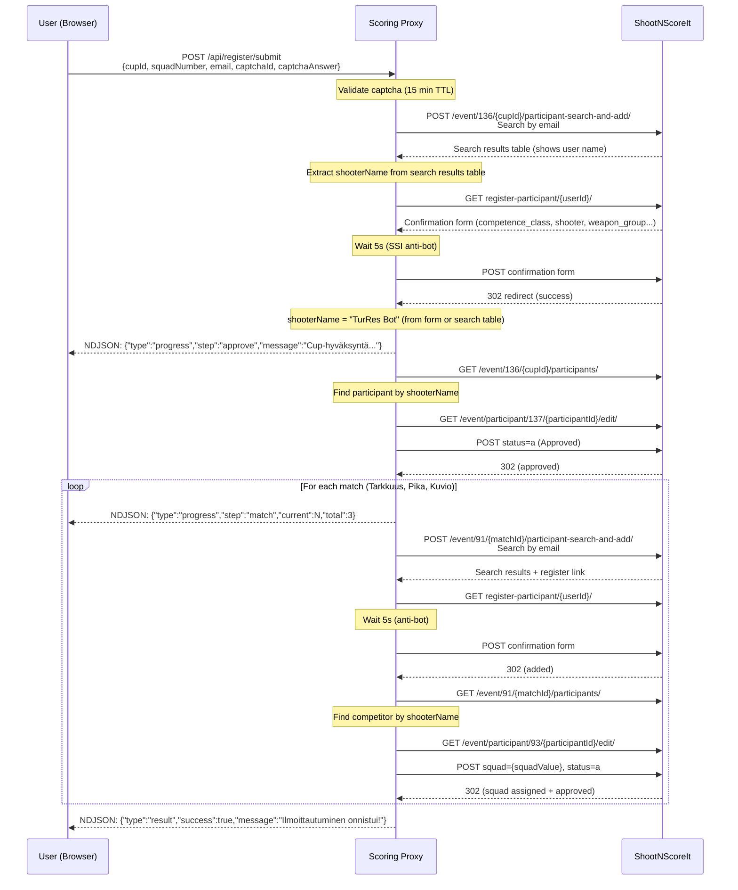
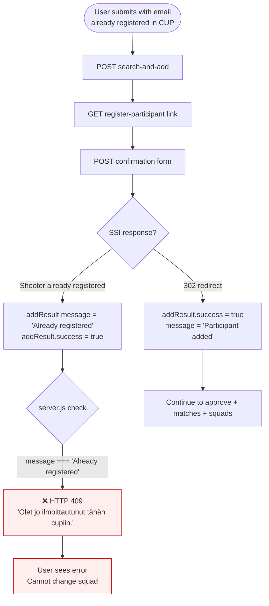
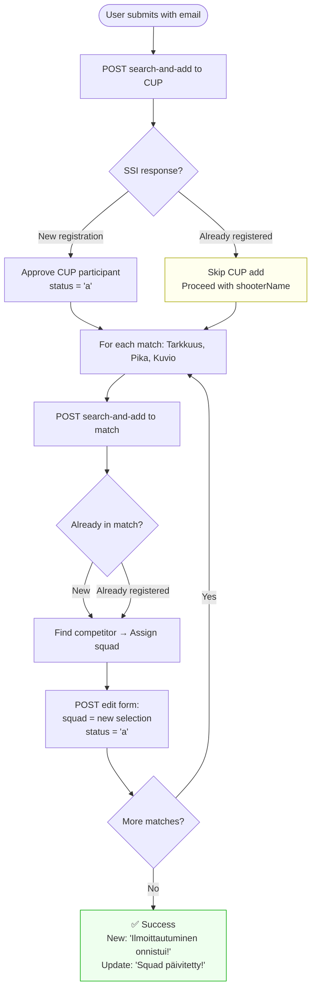
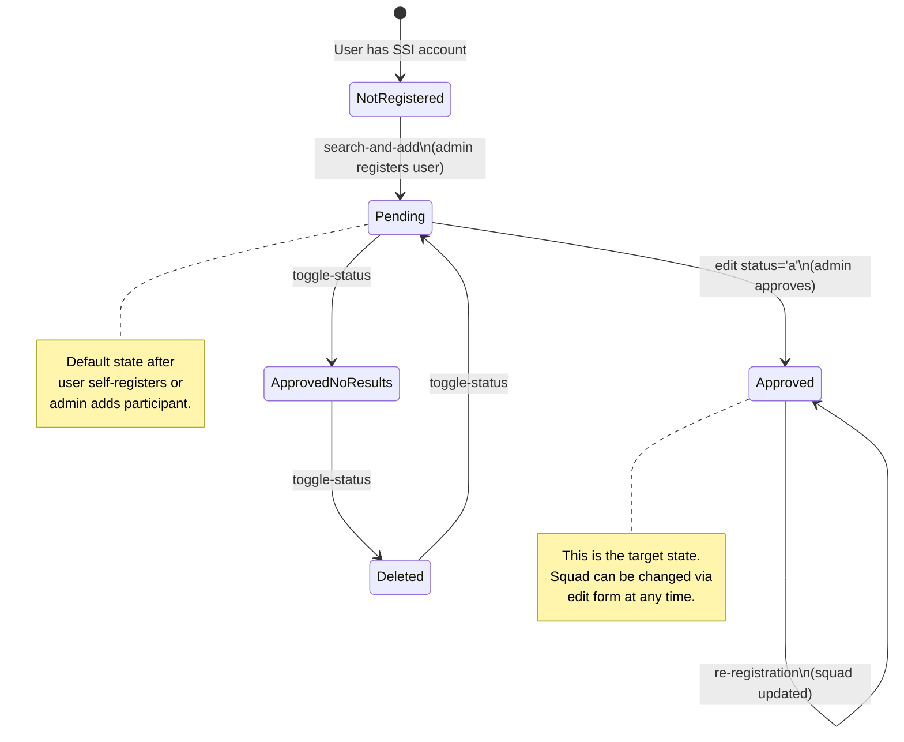

# Registration & Re-registration Flow

## Overview

The registration system allows shooters to register for Kupittaa RESUL CUP events via a mobile-friendly web form. The backend acts as an admin proxy, performing all SSI operations on behalf of the user using web scraping.

## Frontend Flow (User perspective)

## Backend Flow — First Registration

## Current Re-registration Handling

### Problem

When a user is already registered in the CUP, the current code returns HTTP 409 and stops. This means:

1. **User cannot change their squad** — they're stuck with whatever they originally picked
2. **User cannot fix mistakes** — wrong squad selection requires admin intervention
3. **No feedback** — user doesn't know which squad they're currently in

The CUP registration is blocked, but the user may or may not be registered in the component matches (Tarkkuus, Pika, Kuvio). If they registered before the match registration step completed, they could be in an inconsistent state.

## Proposed Re-registration Flow

Instead of blocking, treat "already registered" as a valid state and proceed to update squad assignments:

### Key changes needed

1. **Don't block on "Already registered"** — treat it as success, continue to match registration
2. **`ssiSearchAndAddParticipant` for matches** already handles "already registered" gracefully — it returns `success: true`
3. **`ssiSetParticipantSquad` overwrites** the squad — calling it again simply updates the assignment
4. **`ssiFindAndApproveCupParticipant` checks** if already approved and skips if so
5. **Differentiate UI message** — "Ilmoittautuminen onnistui!" vs "Squad päivitetty!"

### What already works for re-registration

| Step | Already handles re-registration? | Notes |
|---|---|---|
| CUP search-and-add | ✅ Returns `success: true, message: 'Already registered'` | But server blocks with 409 |
| CUP approve | ✅ Checks if already approved, skips | `"Already approved"` |
| Match search-and-add | ✅ Returns `success: true` for both new and existing | Same "Already registered" handling |
| Match find competitor | ✅ Finds by name regardless of state | Works for existing participants |
| Squad assignment | ✅ Overwrites squad via edit form | Simply sets new squad value |

**The only change needed is in `server.js`**: remove the 409 block and let the flow continue.

## SSI State Diagram (per participant)

## Timing & TTL Considerations

```mermaid
gantt
    title Registration Timeline
    dateFormat X
    axisFormat %M:%S

    section User Actions
    Captcha answer        :a1, 0, 10
    Browse cups           :a2, 10, 60
    Select squad          :a3, 60, 30
    Enter email           :a4, 90, 30
    Submit                :a5, 120, 5

    section Backend (per submit)
    CUP search-and-add    :b1, 125, 7
    CUP approve           :b2, 132, 3
    Match 1 add + squad   :b3, 135, 8
    Match 2 add + squad   :b4, 143, 8
    Match 3 add + squad   :b5, 151, 8

    section Captcha TTL
    15 min window         :crit, c1, 0, 900
```

- **Captcha TTL**: 15 minutes from creation (step 1) to validation (submit)
- **Anti-bot delay**: 5 seconds per SSI form submission (4 forms = 20s minimum)
- **Total backend time**: ~25-35 seconds for full registration (CUP + 3 matches)
- **Re-registration**: Slightly faster since CUP add returns immediately with "Already registered"
