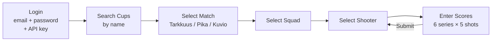
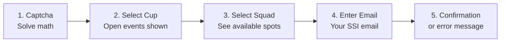

# User Guide

## Scoring App

The scoring app is a mobile-first web application for range officers to enter shooting scores during Kupittaa RESUL CUP matches.

**URL**: `https://tapahtumakalenteri-ssi-integrator.onrender.com`

### Login

1. Open the app on your phone or tablet
2. Enter your **SSI email**, **password**, and **API key**
3. Tap **Kirjaudu** (Login)
4. Optional: enable **Remember me** to stay logged in between sessions

> Your credentials are encrypted (AES-GCM) and stored locally on your device. The server never stores your password.

### Scoring a Match

1. **Search** — Type a cup name (e.g. "Kupittaa") to find your event
2. **Match** — Select the match type (Tarkkuus, Pika, or Kuvio)
3. **Squad** — Select the squad you are scoring
4. **Shooter** — Tap a shooter name. Unscored shooters are highlighted
5. **Score entry** — Tap zone buttons (X, 10, 9, ... 1, M) for each shot
6. **Submit** — Scores are sent to SSI and verified via read-back
7. **Next shooter** — You return to the shooter list automatically

### Score Entry Buttons

| Button | Points | Description |
|--------|--------|-------------|
| **X** | 10 | Inner ten (center) |
| **10** – **1** | 10 – 1 | Ring values |
| **M** | 0 | Miss |

Each series has 5 shots. A match has 6 series (3 series × 2 in double-series mode).

### Tips

- **Install as app**: Use your browser's "Add to Home Screen" for a native-like experience
- **Works on any device**: Phone, tablet, or desktop
- **Session**: Your login is valid for 8 hours. After that, re-login is automatic if Remember me is enabled
- **Navigation state**: If you close the app mid-scoring, it reopens where you left off

---

## Registration App

The registration app allows shooters to self-register for upcoming Kupittaa CUP events.

**URL**: `https://tapahtumakalenteri-ssi-integrator.onrender.com/#/register`

### Prerequisites

You need a ShootNScoreIt (SSI) account. If you don't have one, register at [shootnscoreit.com/signup](https://shootnscoreit.com/signup/?next=/dashboard/).

### Registration Steps

1. **Captcha** — Solve the math question and tap **Jatka** (Continue)
2. **Select Cup** — Open cups are shown with a green indicator and available spots. Upcoming cups are greyed out
3. **Select Squad** — Choose your squad. Full squads show **TÄYNNÄ** and are disabled
4. **Enter email** — Enter the email address you used to register on SSI. A summary of your selections is shown above
5. **Result** — You see a confirmation or an error message

### After Registration

- You receive a **confirmation email** listing your cup, matches, and squad assignment
- To **change your squad**, simply register again — your squad is updated
- To **withdraw**, go to [SSI My Registrations](https://shootnscoreit.com/my-registrations/)

### Troubleshooting

| Situation | What to do |
|-----------|------------|
| "Sähköpostiosoitetta ei löydy SSI-järjestelmästä" | Create an SSI account first, then try again |
| "Liian monta yritystä" | Wait 10 minutes and try again |
| "Varmistus vanhentui" | Captcha expired — solve the new one, your selections are preserved |
| No confirmation email | Check your spam folder. Email is sent from `no-reply@ssi.towi.me` |
